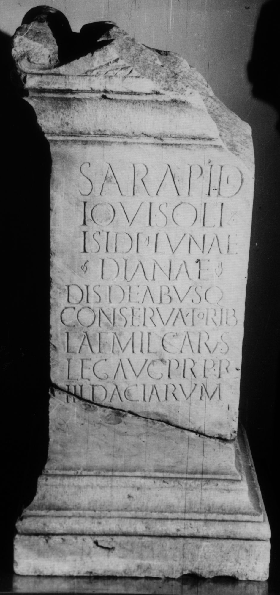

# EDH HD038519. Apulum

**Країна.** Румунія

**Провінція (код EDH).** Dac

**Місце знахідки (антична назва).** Apulum

**Сучасна назва.** Alba Iulia

**Деталі знахідки.** Praetorium des Statthalters

**Координати.** 46.076691,23.580099

**Зберігання.** Deva, Muz. Civil. Dac. şi Rom.

**Датування (роки, від'ємні до н. е.).** 173 … 175

**Матеріал.** Marmor

**Тип пам'ятки.** Altar

**Розміри (висота, ширина, глибина, см).** -124.0 × -57.0 × 56.0

## Текст (латинь, скорочення розкрито)

```
Sarapidi / Iovi Soli / Isidi Lunae / Dianae / dis deabusq(ue) / conservatorib(us) / L(ucius) Aemil(ius) Carus / leg(atus) Aug(usti) pr(o) pr(aetore) / III Daciarum
```

## Текст у вихідному записі

```
SARAPIDI / IOVI SOLI / ISIDI LVNAE / DIANAE / DIS DEABVSQ / CONSERVATORIB / L AEMIL CARVS / LEG AVG PR PR / III DACIARVM
```

## Коментар

Altar in zwei Teile gebrochen; Bekrönung zum Teil zerstört. Z. 2-4: hederae. (B): Bricault: Z. 6/7 bei der Textwiedergabe vertauscht.

## Література

IDR 3, 5, 319; Foto.
- CIL 03, 07771.
- ILS 4398.
- PIR (2. Aufl.) A 338.
- I. Piso, Fasti provinciae Daciae 1. Die senatorischen Amtsträger (Bonn 1993) 105-106, Nr. 23.
- SIRIS 690.
- L. Bricault, Recueil des inscriptions concernant les cultes Isiaques (RICIS) (Paris 2005) 730-731, Nr. 616/0402; pl. 125, 616/0402. (B) #

## Фото



Джерело https://edh.ub.uni-heidelberg.de/edh/inschrift/HD038519, ліцензія CC BY-SA 4.0. Оригінальний XML в архіві сирі_дані/edh_xml.zip
