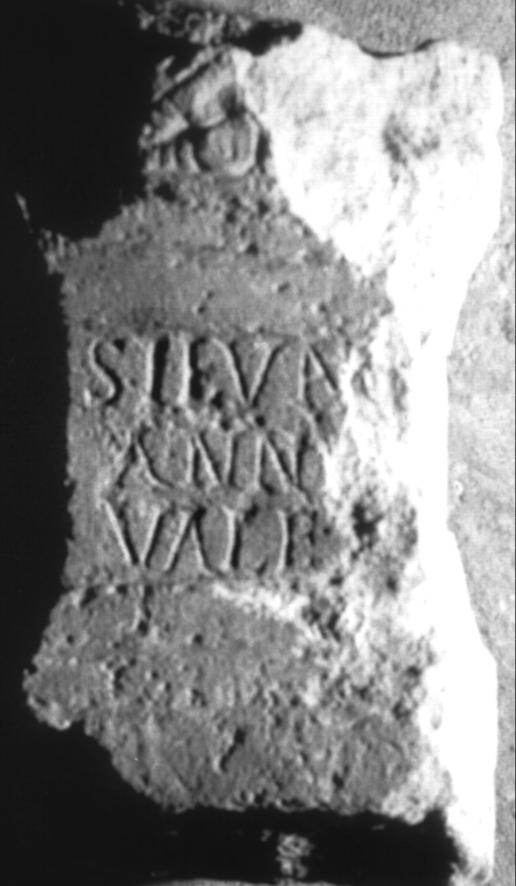

# EDH HD038524. Apulum

**Країна.** Румунія

**Провінція (код EDH).** Dac

**Місце знахідки (антична назва).** Apulum

**Сучасна назва.** Alba Iulia

**Деталі знахідки.** canabae

**Координати.** 46.0669444,23.569999999

**Зберігання.** Alba Iulia, Muz. Unirii

**Датування (роки, від'ємні до н. е.).** 151 … 275

**Матеріал.** Kalkstein

**Тип пам'ятки.** Altar

**Розміри (висота, ширина, глибина, см).** -28.0 × -16.5 × -14.5

## Текст (латинь, скорочення розкрито)

```
Silvan[o] / Anniu[s] / Vale[ns]
```

## Текст у вихідному записі

```
SILVAN[ ] / ANNIV[ ] / VALE[ ]
```

## Коментар

Bekrönung, Inschriftfeld und Basis zum Teil zerstört.

## Література

IDR 3, 5, 321; Foto u. Zeichnung. #

## Фото



Джерело https://edh.ub.uni-heidelberg.de/edh/inschrift/HD038524, ліцензія CC BY-SA 4.0. Оригінальний XML в архіві сирі_дані/edh_xml.zip
