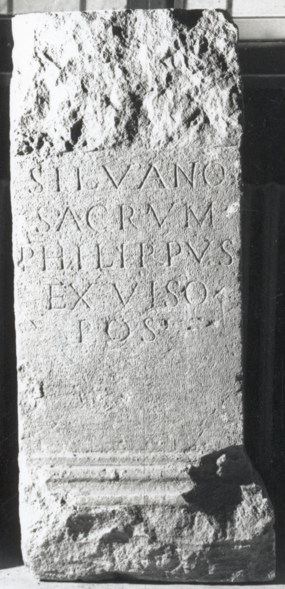

# EDH HD038546. Apulum

**Країна.** Румунія

**Провінція (код EDH).** Dac

**Місце знахідки (антична назва).** Apulum

**Сучасна назва.** Alba Iulia

**Координати.** 46.0669444,23.569999999

**Рік знахідки.** 1845

**Зберігання.** Alba Iulia, Muz. Unirii

**Датування (роки, від'ємні до н. е.).** 151 … 275

**Матеріал.** Kalkstein

**Тип пам'ятки.** Altar?

**Розміри (висота, ширина, глибина, см).** -69.0 × -42.0 × -33.0

## Текст (латинь, скорочення розкрито)

```
Silvano / sacrum / Philippus / ex viso / pos(uit)
```

## Текст у вихідному записі

```
SILVANO / SACRVM / PHILIPPVS / EX VISO / POS
```

## Коментар

Bekrönung und Basis zerstört.

## Література

IDR 3, 5, 326; Foto.
- CIL 03, 01144. #

## Фото



Джерело https://edh.ub.uni-heidelberg.de/edh/inschrift/HD038546, ліцензія CC BY-SA 4.0. Оригінальний XML в архіві сирі_дані/edh_xml.zip
