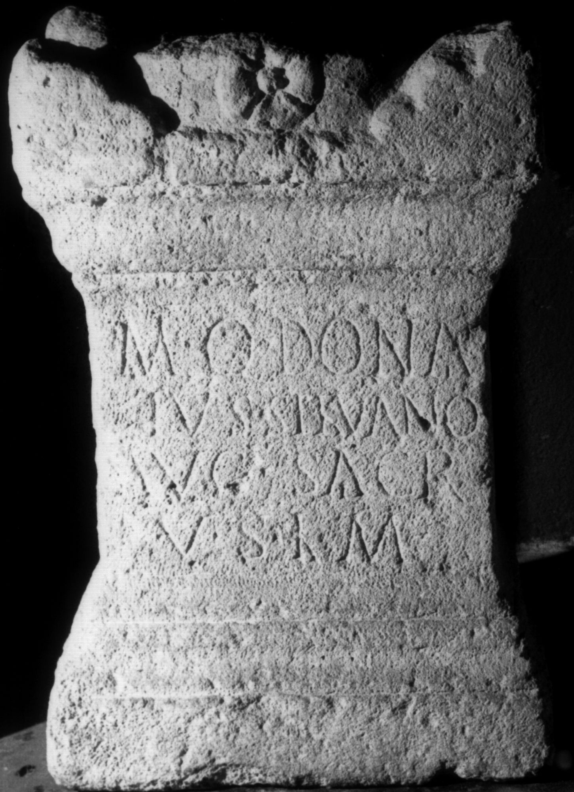

# EDH HD038553. Apulum

**Країна.** Румунія

**Провінція (код EDH).** Dac

**Місце знахідки (антична назва).** Apulum

**Сучасна назва.** Alba Iulia

**Деталі знахідки.** {Festung}

**Координати.** 46.068288248,23.571209907

**Рік знахідки.** -1723

**Зберігання.** Sibiu, Muz. Brukenthal

**Датування (роки, від'ємні до н. е.).** 171 … 275

**Матеріал.** Kalkstein

**Тип пам'ятки.** Altar

**Розміри (висота, ширина, глибина, см).** 62.0 × 42.0 × 29.0

## Текст (латинь, скорочення розкрито)

```
M(arcus) Q(---) Dona/tus Silvano / Aug(usto) sacr(um) / v(otum) s(olvit) l(ibens) m(erito)
```

## Текст у вихідному записі

```
M Q DONA / TVS SILVANO / AVG SACR / V S L M
```

## Література

IDR 3, 5, 331; Foto.
- CIL 03, 01146.
- A. Buonopane - V. La Monaca, in: G.P. Marchi - J. Pál (Hrsg.), Epigrafi romane di Transilvania. Bibliotheca Capitolare di Verona, Manoscritto CCLXVII (Verona - Szeged 2010) 324, Nr. 8; Foto u. Zeichnung. #

## Фото



Джерело https://edh.ub.uni-heidelberg.de/edh/inschrift/HD038553, ліцензія CC BY-SA 4.0. Оригінальний XML в архіві сирі_дані/edh_xml.zip
