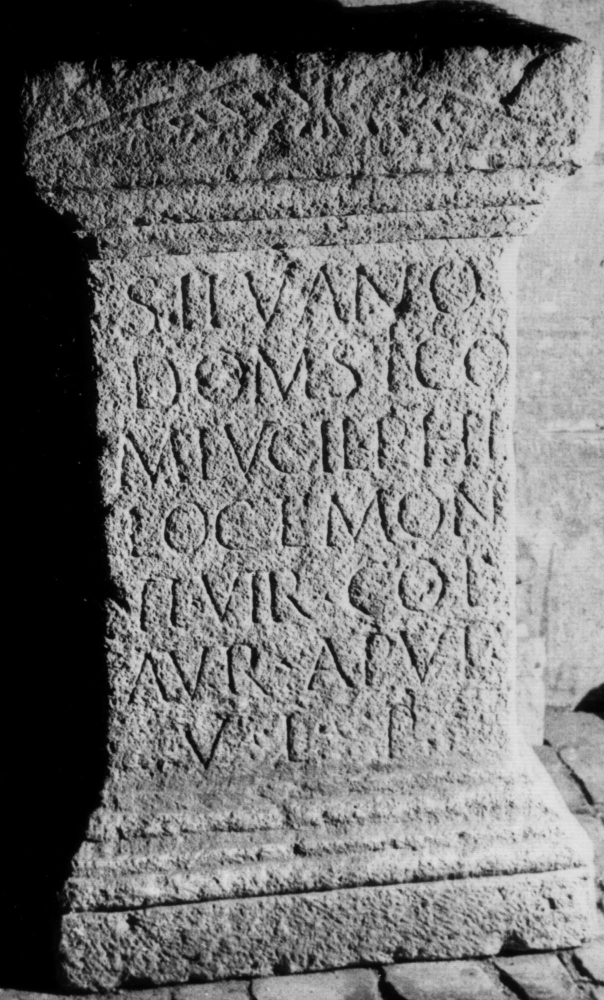

# EDH HD038563. Apulum

**Країна.** Румунія

**Провінція (код EDH).** Dac

**Місце знахідки (антична назва).** Apulum

**Сучасна назва.** Alba Iulia

**Деталі знахідки.** {Partoş}

**Координати.** 46.0463184,23.566650100

**Зберігання.** Sibiu, Muz. Brukenthal

**Датування (роки, від'ємні до н. е.).** 180 … 275

**Матеріал.** Kalkstein

**Тип пам'ятки.** Statuenbasis

**Розміри (висота, ширина, глибина, см).** 76.0 × 44.0 × 34.0

## Текст (латинь, скорочення розкрито)

```
Silvano / Domestico / M(arcus) Lucil(ius) Philoctemon / IIvir col(oniae) / Aur(eliae) Apul(ensis) / v(oto) l(ibens) p(osuit)
```

## Текст у вихідному записі

```
SILVANO / DOMESTICO / M LVCIL PHILOCTEMON / IIVIR COL / AVR APVL / V L P
```

## Література

IDR 3, 5, 339; Foto.
- CIL 03, 07773. #

## Фото



Джерело https://edh.ub.uni-heidelberg.de/edh/inschrift/HD038563, ліцензія CC BY-SA 4.0. Оригінальний XML в архіві сирі_дані/edh_xml.zip
