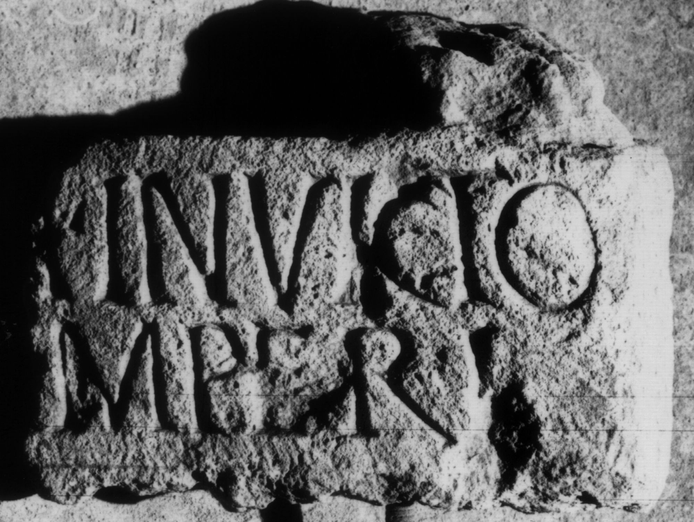

# EDH HD038574. Apulum

**Країна.** Румунія

**Провінція (код EDH).** Dac

**Місце знахідки (антична назва).** Apulum

**Сучасна назва.** Alba Iulia

**Деталі знахідки.** {Festung} - {Partoş}, zwischen

**Координати.** 46.064655616,23.570480346

**Рік знахідки.** 1899

**Зберігання.** Alba Iulia, Muz. Unirii

**Датування (роки, від'ємні до н. е.).** 171 … 270

**Матеріал.** Kalkstein

**Тип пам'ятки.** Statuenbasis

**Розміри (висота, ширина, глибина, см).** -24.0 × -17.5 × -8.5

## Текст (латинь, скорочення розкрито)

```
[---]i Invicto / [pro salute] imperi(i) / [------]
```

## Текст у вихідному записі

```
[ ]I INVICTO / [ ] IMPERI / [ ]
```

## Коментар

Basis einer Votivstatuette, deren linker Fuß auf der Basisoberseite noch erhalten ist. Statuettee und Basis sind aus einem Stück gearbeitet.

## Література

IDR 3, 5, 357; Foto u. Zeichnung.
- CIL 03, 14475. #

## Фото



Джерело https://edh.ub.uni-heidelberg.de/edh/inschrift/HD038574, ліцензія CC BY-SA 4.0. Оригінальний XML в архіві сирі_дані/edh_xml.zip
