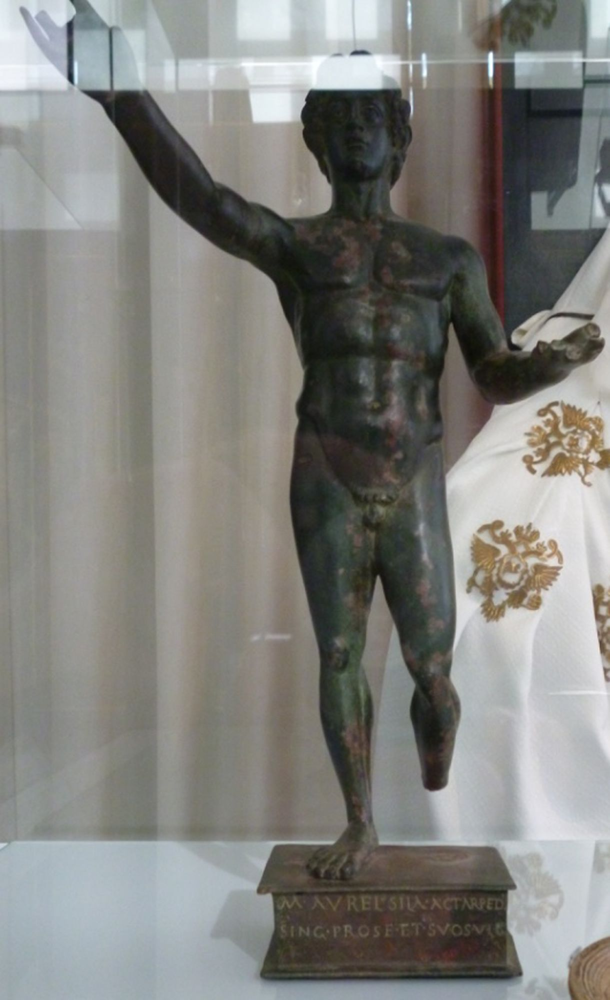
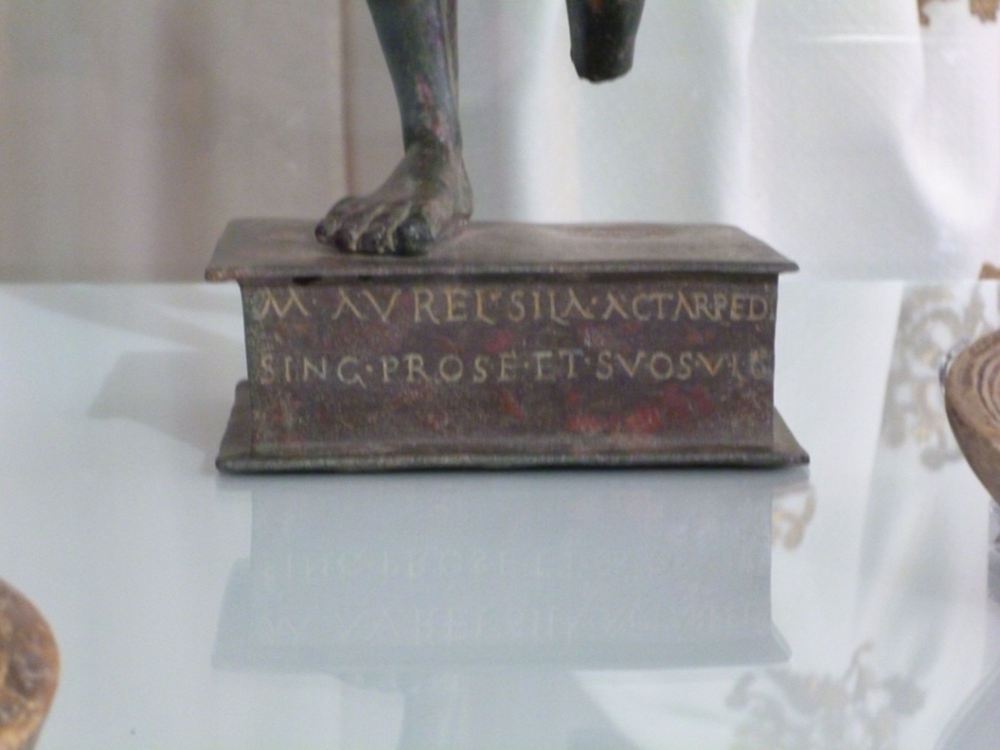

# EDH HD038575. Apulum

**Країна.** Румунія

**Провінція (код EDH).** Dac

**Місце знахідки (антична назва).** Apulum

**Сучасна назва.** Alba Iulia

**Деталі знахідки.** Partoş, {Strada Reg. 5 Vânători} 20

**Координати.** 46.044366509,23.564338050

**Рік знахідки.** 1926

**Зберігання.** Hannover, Mus. Aug. Kest.

**Датування (роки, від'ємні до н. е.).** 171 … 230

**Матеріал.** Bronze

**Тип пам'ятки.** Statuenbasis

**Розміри (висота, ширина, глибина, см).** 5.0

## Текст (латинь, скорочення розкрито)

```
M(arcus) Aurel(ius) Sila actar(ius) ped(itum) / sing(ularium) pro se et suos(!) v(otum) l(ibens) s(olvit)
```

## Текст у вихідному записі

```
M AVREL SILA ACTAR PED / SING PRO SE ET SVOS V L S
```

## Коментар

Basis einer Bronzestatuette des Sol. Gesamthöhe inklusive Statuette: 53 cm. Schreibtechnik: eingraviert. (B): Zefleanu; IDR: Z. 1: Sila a/ctar. eq.; Tudor; AE 1962: Z. 2 (Ende): E (statt EQ).

## Література

AE 1962, 0208. (B)
- AE 2015, 1177.
- IDR 3, 5, 358. (B)
- E. Zefleanu, Apulum 3, 1949, 170-171, Nr. 1. (B) - AE 1962.
- D. Tudor, FA 13, 1958, 355, Nr. 5670. (B) - AE 1962.
- R. Wiegels, Varus-Kurier 15, 2013, 1-5; Abb. 2. - AE 2015.
- G. Cupcea, Dacia 59, 2015, 55, Nr. 10; Zeichnung. - AE 2015. #

## Фото





Джерело https://edh.ub.uni-heidelberg.de/edh/inschrift/HD038575, ліцензія CC BY-SA 4.0. Оригінальний XML в архіві сирі_дані/edh_xml.zip
