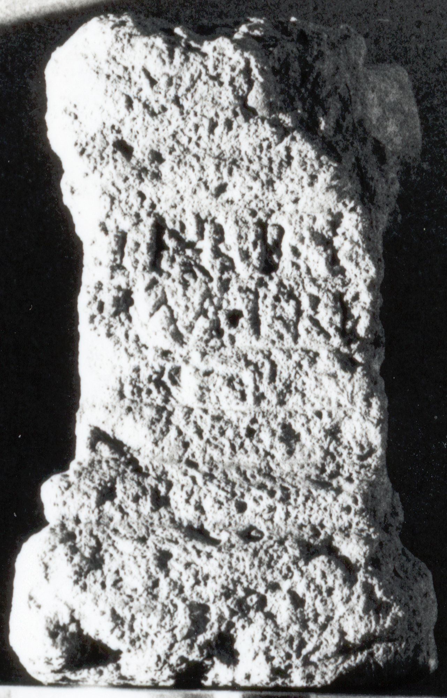

# EDH HD038577. Apulum

**Країна.** Румунія

**Провінція (код EDH).** Dac

**Місце знахідки (антична назва).** Apulum

**Сучасна назва.** Alba Iulia

**Деталі знахідки.** Festung, {Strada Unirii} 15

**Координати.** 46.068679007,23.572689187

**Рік знахідки.** 1956

**Зберігання.** Alba Iulia, Muz. Unirii

**Датування (роки, від'ємні до н. е.).** 107 … 275

**Матеріал.** Kalkstein

**Тип пам'ятки.** Altar

**Розміри (висота, ширина, глибина, см).** 33.0 × 20.0 × 19.0

## Текст (латинь, скорочення розкрито)

```
Terr(a)e / Matri
```

## Текст у вихідному записі

```
TERRE / MATRI
```

## Коментар

Zeilenlinien für 4 Zeilen vorgesehen, jedoch nur Z. 1 u. 2 geschrieben.

## Література

IDR 3, 5, 360; Foto u. Zeichnung. #

## Фото



Джерело https://edh.ub.uni-heidelberg.de/edh/inschrift/HD038577, ліцензія CC BY-SA 4.0. Оригінальний XML в архіві сирі_дані/edh_xml.zip
