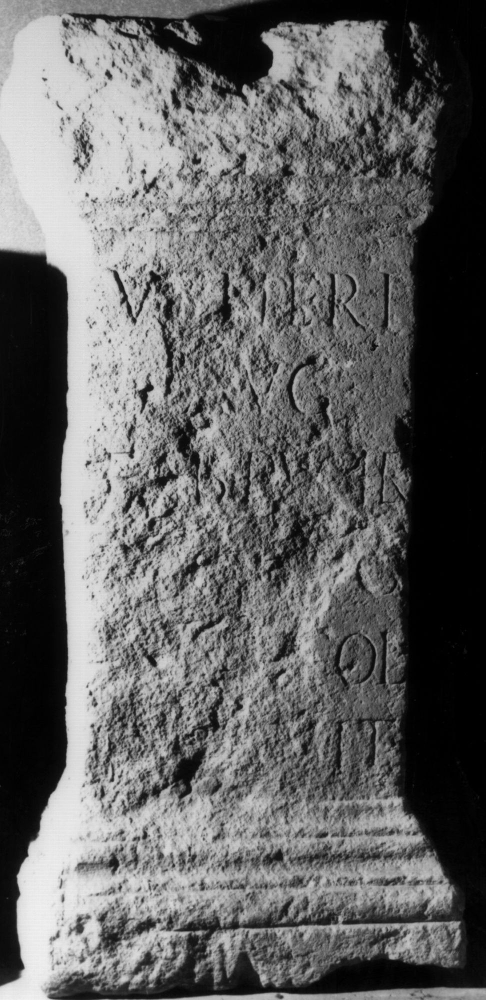

# EDH HD038580. Apulum

**Країна.** Румунія

**Провінція (код EDH).** Dac

**Місце знахідки (антична назва).** Apulum

**Сучасна назва.** Alba Iulia

**Деталі знахідки.** {Partoş}

**Координати.** 46.0463184,23.566650100

**Зберігання.** Alba Iulia, Muz. Unirii

**Датування (роки, від'ємні до н. е.).** 193 … 230

**Матеріал.** Sandstein

**Тип пам'ятки.** Statuenbasis

**Розміри (висота, ширина, глибина, см).** 120.0 × 55.0 × 50.0

## Текст (латинь, скорочення розкрито)

```
Veneri / Aug(ustae) / Fab(ius) Pulcher / [--- A]ug(---) / [---] col(oniae) / [vot(um)? sol]vit
```

## Текст у вихідному записі

```
VENERI / AVG / FAB PVLCHER / [ ]VG / [ ] COL / [ ]VIT
```

## Коментар

Gefunden am Fuße des Dealul Furcilor. Bekrönung und Basis zum Teil zerstört; auf der Oberseite Spuren von der Befestigung der Statue.

## Література

AE 2010, 1377.
- R. Ardevan, ACD 46, 2010, 126-127; Abb. 2. (Foto u. Zeichnung). - AE 2010.
- CIL 03, 01157.
- IDR 3, 5, 363; Foto u. Zeichnung. #

## Фото



Джерело https://edh.ub.uni-heidelberg.de/edh/inschrift/HD038580, ліцензія CC BY-SA 4.0. Оригінальний XML в архіві сирі_дані/edh_xml.zip
