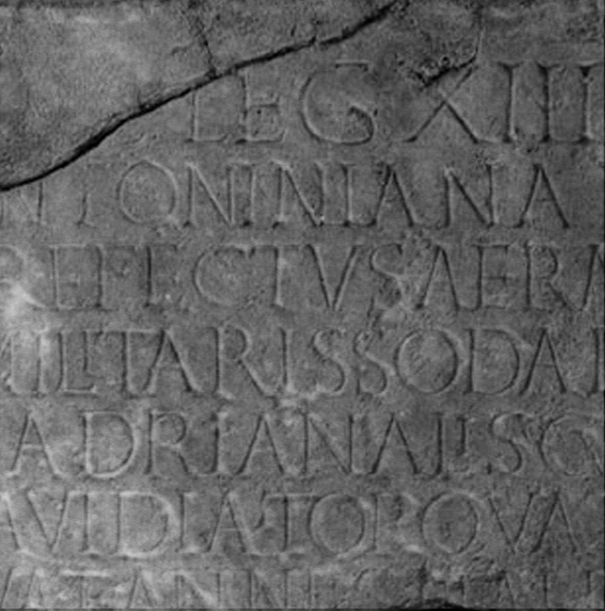

# EDH HD038583. Apulum

**Країна.** Румунія

**Провінція (код EDH).** Dac

**Місце знахідки (антична назва).** Apulum

**Сучасна назва.** Alba Iulia

**Координати.** 46.0669444,23.569999999

**Рік знахідки.** -1600

**Зберігання.** Wien, Nationalbibl.

**Датування (роки, від'ємні до н. е.).** 215 … 217

**Матеріал.** Kalkstein

**Тип пам'ятки.** Altar?

## Текст (латинь, скорочення розкрито)

```
[Victoriae] / [Antonini] / [Aug(usti)] / [L(ucius) Annius Italicus] / [Honora]tus leg(atus) / [Au]g(usti) leg(ionis) XIII g(eminae) / Antoninianae / pr(a)efectus aerarii / militaris sodalis / Hadrianali cum / Gavidia Torquata / sua et Anniis Italico / et Ho[norato et] / [Italica filiis]
```

## Текст у вихідному записі

```
[ ] / [ ] / [ ] / [ ] / [ ]TVS LEG / [ ]G LEG XIII G / ANTONINIANAE / PREFECTVS AERARII / MILITARIS SODALIS / HADRIANALI CVM / GAVIDIA TORQVATA / SVA ET ANNIIS ITALICO / ET HO[ ] / [ ]
```

## Коментар

Fragment vom Mittelteil eines Altars oder einer Statuenbasis; teilweise modern ergänzt. Die Inschrift war bei der Auffindung noch vollständig erhalten. Z. 14 (Ende): hedera. (B): CIL III 1072: Z. 6: [Aug. le]g. XIII g.; Piso, Fasti: Z. 8: praefectus.

## Література

IDR 3, 5, 365; Zeichnung.
- CIL 03, 01072. (B)
- I. Piso, Fasti provinciae Daciae 1. Die senatorischen Amtsträger (Bonn 1993) 253-257, Nr. 62, 2. (B)
- A. Buonopane - V. La Monaca, in: G.P. Marchi - J. Pál (Hrsg.), Epigrafi romane di Transilvania. Bibliotheca Capitolare di Verona, Manoscritto CCLXVII (Verona - Szeged 2010) 276, Nr. 23; Foto u. Zeichnung.
- PIR (2. Aufl.) A 659. #

## Фото



Джерело https://edh.ub.uni-heidelberg.de/edh/inschrift/HD038583, ліцензія CC BY-SA 4.0. Оригінальний XML в архіві сирі_дані/edh_xml.zip
