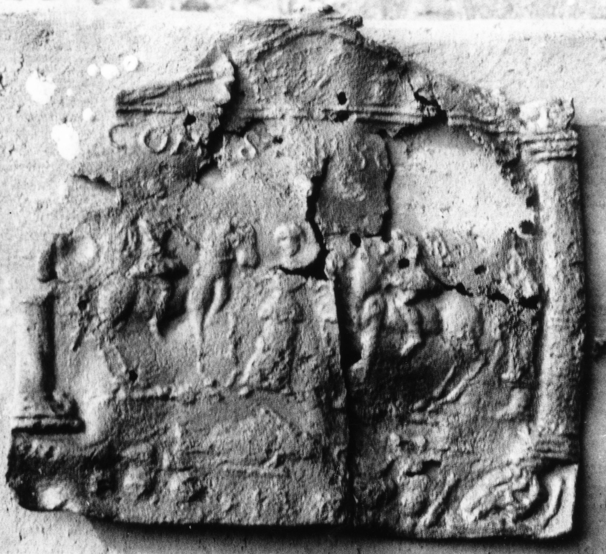

# EDH HD038588. Apulum

**Країна.** Румунія

**Провінція (код EDH).** Dac

**Місце знахідки (антична назва).** Apulum

**Сучасна назва.** Alba Iulia

**Деталі знахідки.** {Partoş}, Tempel des Liber Pater

**Координати.** 46.050245046,23.564944519

**Зберігання.** Alba Iulia, Muz. Unirii

**Датування (роки, від'ємні до н. е.).** 171 … 275

**Матеріал.** Blei

**Тип пам'ятки.** Tessera

**Розміри (висота, ширина, глибина, см).** 11.0 × 12.0 × 0.2

## Текст (латинь, скорочення розкрито)

```
Coh(ors)(?) I S(agittariorum?) Tibisc[ensium?]
```

## Текст у вихідному записі

```
COH I S TIBISC[ ]
```

## Коментар

Tessera in Form einer aedicula. Unvollständig erhalten. Datierung: Der Tempel befindet sich auf den Befestigungsmauern des Municipium Aurelium.

## Література

IDR 3, 5, 371; Foto u. Zeichnung. #

## Фото



Джерело https://edh.ub.uni-heidelberg.de/edh/inschrift/HD038588, ліцензія CC BY-SA 4.0. Оригінальний XML в архіві сирі_дані/edh_xml.zip
