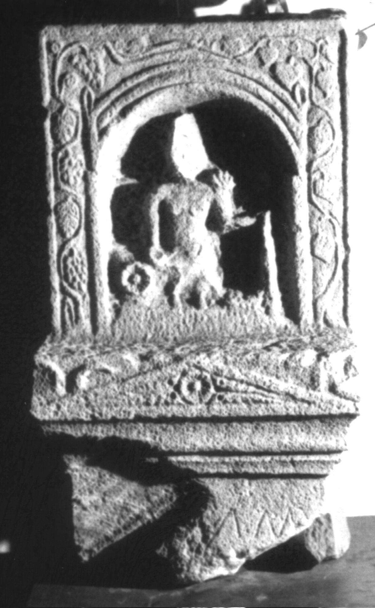

# EDH HD038589. Apulum

**Країна.** Румунія

**Провінція (код EDH).** Dac

**Місце знахідки (антична назва).** Apulum

**Сучасна назва.** Alba Iulia

**Деталі знахідки.** Platoul Romanilor, {Polygon}, bei

**Координати.** 46.069317617,23.565303587

**Рік знахідки.** 1980

**Зберігання.** Alba Iulia, Muz. Unirii

**Датування (роки, від'ємні до н. е.).** 201 … 275

**Матеріал.** Kalkstein

**Тип пам'ятки.** Basis

**Розміри (висота, ширина, глибина, см).** -52.0 × 30.0 × 22.0

## Текст (латинь, скорочення розкрито)

```
[---]MMV / [&
```

## Текст у вихідному записі

```
[ ]MMV / [
```

## Коментар

Altarförmige Basis für ein Relief; in einem Stück gearbeitet; Maße beziehen sich auf das gesamte Monument. Auf dem Relief nischenförmige aedicula mit der Darstellung eines thronenden Gottes mit einem Szepter in der Linken und einer patera(?) in der Rechten. Fundjahr: gegen 1980.

## Література

IDR 3, 5, 372; Foto u. Zeichnung. #

## Фото



Джерело https://edh.ub.uni-heidelberg.de/edh/inschrift/HD038589, ліцензія CC BY-SA 4.0. Оригінальний XML в архіві сирі_дані/edh_xml.zip
