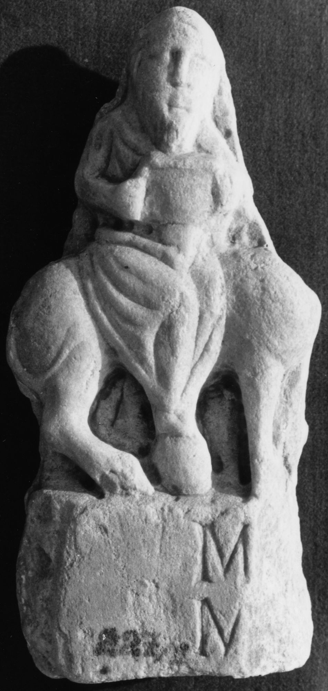

# EDH HD038590. Apulum

**Країна.** Румунія

**Провінція (код EDH).** Dac

**Місце знахідки (антична назва).** Apulum

**Сучасна назва.** Alba Iulia

**Деталі знахідки.** Festung, {Batthyaneum}

**Координати.** 46.070491530,23.570681512

**Зберігання.** Alba Iulia, Muz. Unirii

**Датування (роки, від'ємні до н. е.).** 151 … 270

**Матеріал.** Marmor

**Тип пам'ятки.** Basis

## Текст (латинь, скорочення розкрито)

```
M[---?] / M[---?]
```

## Текст у вихідному записі

```
M[ ] / M[ ]
```

## Коментар

Basis mit Relief auf dem oberen Teil in einem Stück gearbeitet. Nur linker Teil des Reliefs und der Basis erhalten. Darstellung eines Silenus mit Gefäß auf einem Esel. Der nicht erhaltene Teil des Reliefs enthielt ursprünglich wahrscheinlich eine Darstellung des Liber Pater.

## Література

IDR 3, 5, 373; Foto.
- CIL 03, 01168. #

## Фото



Джерело https://edh.ub.uni-heidelberg.de/edh/inschrift/HD038590, ліцензія CC BY-SA 4.0. Оригінальний XML в архіві сирі_дані/edh_xml.zip
