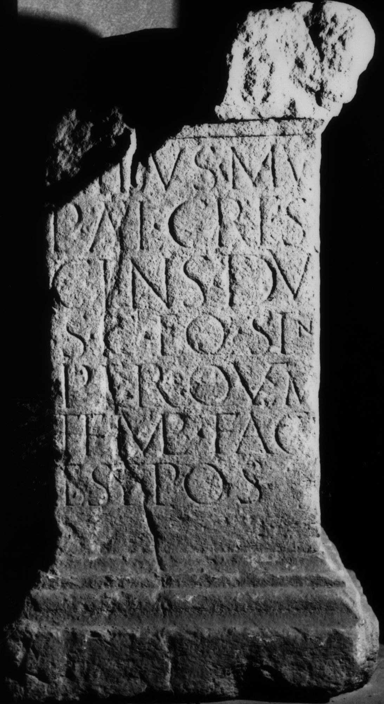

# EDH HD038591. Apulum

**Країна.** Румунія

**Провінція (код EDH).** Dac

**Місце знахідки (антична назва).** Apulum

**Сучасна назва.** Alba Iulia

**Деталі знахідки.** {Festung}

**Координати.** 46.068288248,23.571209907

**Зберігання.** Alba Iulia, Muz. Unirii

**Датування (роки, від'ємні до н. е.).** 168 … 275

**Матеріал.** Gesteine

**Тип пам'ятки.** Altar?

**Розміри (висота, ширина, глибина, см).** 97.0 × 55.0 × 43.0

## Текст (латинь, скорочення розкрито)

```
[------?] / [-]ibus mu(---?) / P(ublius) Ael(ius) Cres/cens du(plicarius) / s(ingularis) c(onsularis) eq(uitum) sin(gularium) / per quem / templ(um) fac(tum) / est pos(uit)
```

## Текст у вихідному записі

```
[ ] / [ ]IBVS MV / P AEL CRES / CENS DV / S C EQ SIN / PER QVEM / TEMPL FAC / EST POS
```

## Коментар

Altar oder Statuenbasis. Bekrönung und oberer linker Teil des Inschriftfeldes nicht erhalten.

## Література

IDR 3, 5, 375; Foto u. Zeichnung.
- CIL 03, 01160. #

## Фото



Джерело https://edh.ub.uni-heidelberg.de/edh/inschrift/HD038591, ліцензія CC BY-SA 4.0. Оригінальний XML в архіві сирі_дані/edh_xml.zip
