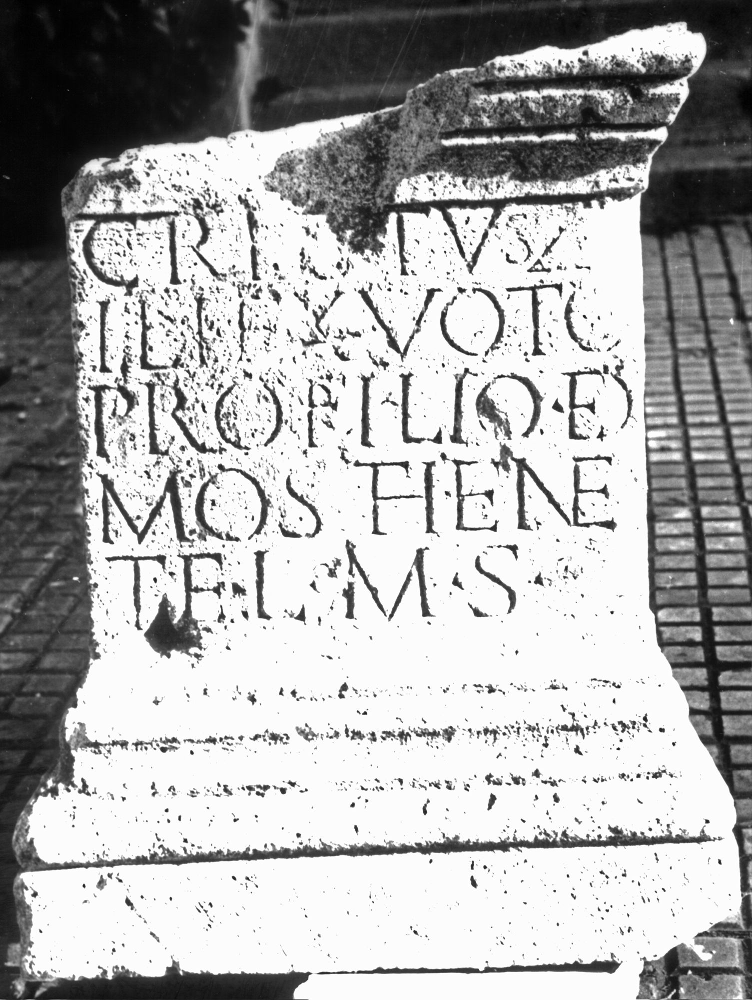

# EDH HD038613. Apulum

**Країна.** Румунія

**Провінція (код EDH).** Dac

**Місце знахідки (антична назва).** Apulum

**Сучасна назва.** Alba Iulia

**Деталі знахідки.** {Partoş}

**Координати.** 46.0463184,23.566650100

**Зберігання.** Alba Iulia, Muz. Unirii

**Датування (роки, від'ємні до н. е.).** 107 … 200

**Матеріал.** Kalkstein

**Тип пам'ятки.** Statuenbasis

**Розміри (висота, ширина, глибина, см).** -72.0 × -54.0 × 44.0

## Текст (латинь, скорочення розкрито)

```
C(h)restus Z[o]/ili / ex voto / pro filio De/mosthene / te(stamento?) l(ibens) m(erito) s(olvit)
```

## Текст у вихідному записі

```
CRESTVS Z[ ] / ILI / EX VOTO / PRO FILIO DE / MOSTHENE / TE L M S
```

## Коментар

(B): Ciugudean - Băluţă, Petolescu, AE 1991: Z. 1/2.: Zo/ili.

## Література

IDR 3, 5, 386; Foto.
- AE 1991, 1340. (B)
- H. Ciugudean - C.L. Băluţă, Apulum 26, 1990, 209, Nr. 3; fig. 3 (Zeichnung). (B) - AE 1991.
- C.C. Petolescu, StCercIstorV 42, 1991, 265-266, Nr. 535. (B) - AE 1991. #

## Фото



Джерело https://edh.ub.uni-heidelberg.de/edh/inschrift/HD038613, ліцензія CC BY-SA 4.0. Оригінальний XML в архіві сирі_дані/edh_xml.zip
