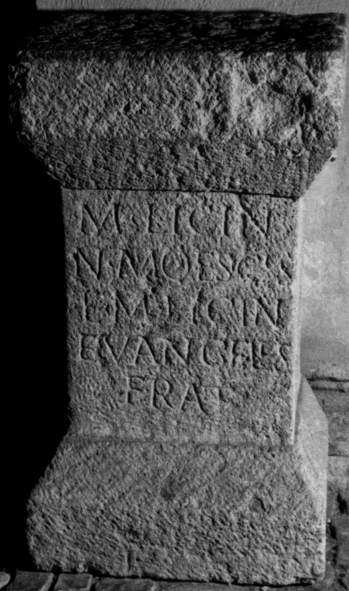

# EDH HD038625. Apulum

**Країна.** Румунія

**Провінція (код EDH).** Dac

**Місце знахідки (антична назва).** Apulum

**Сучасна назва.** Alba Iulia

**Деталі знахідки.** {Partoş}

**Координати.** 46.0463184,23.566650100

**Рік знахідки.** 1867

**Зберігання.** Sibiu, Muz. Brukenthal

**Датування (роки, від'ємні до н. е.).** 151 … 275

**Матеріал.** Kalkstein

**Тип пам'ятки.** Altar?

**Розміри (висота, ширина, глибина, см).** 59.0 × 34.0 × 27.0

## Текст (латинь, скорочення розкрито)

```
M(arcus) Licin/n(ius)(!) Moesicus / et M(arcus) Licin(ius) / Euangelus / frat(res)
```

## Текст у вихідному записі

```
M LICIN / N MOESICVS / ET M LICIN / EVANGELVS / FRAT
```

## Коментар

Altar oder Statuenbasis.

## Література

IDR 3, 5, 389; Foto u. Zeichnung.
- CIL 03, 07811. #

## Фото



Джерело https://edh.ub.uni-heidelberg.de/edh/inschrift/HD038625, ліцензія CC BY-SA 4.0. Оригінальний XML в архіві сирі_дані/edh_xml.zip
