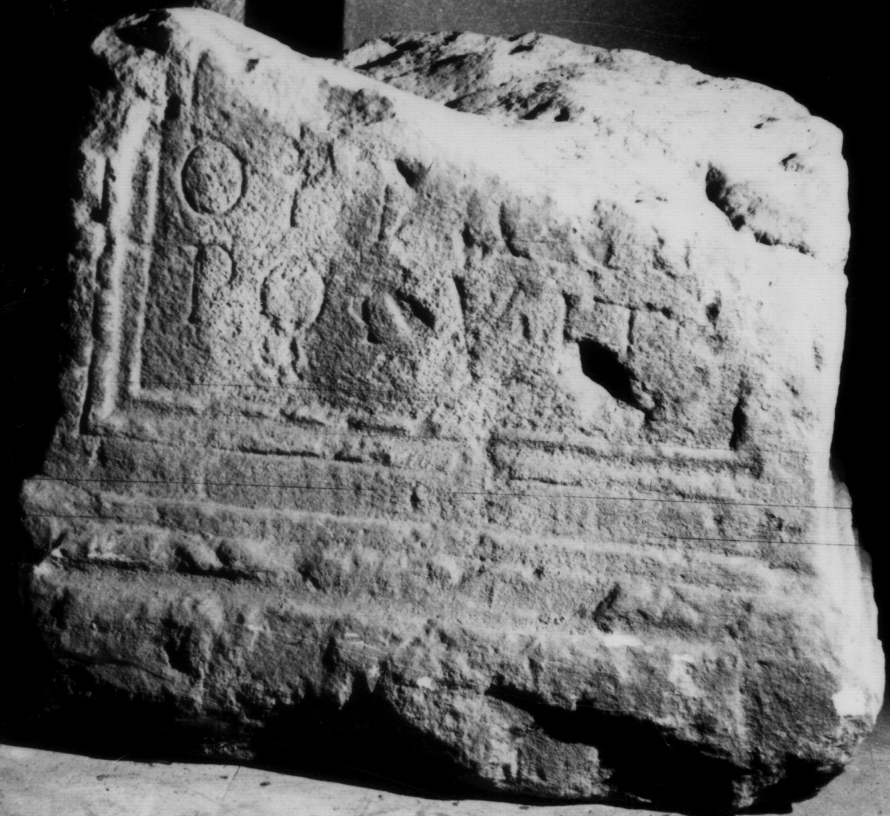

# EDH HD038636. Apulum

**Країна.** Румунія

**Провінція (код EDH).** Dac

**Місце знахідки (антична назва).** Apulum

**Сучасна назва.** Alba Iulia

**Деталі знахідки.** Festung, {Báthory-Kirche}, sekundär verwendet

**Координати.** 46.068786971,23.571510313

**Рік знахідки.** 1898

**Зберігання.** Alba Iulia, Muz. Unirii

**Датування (роки, від'ємні до н. е.).** 151 … 275

**Матеріал.** Kalkstein

**Тип пам'ятки.** Altar?

**Розміри (висота, ширина, глибина, см).** -60.0 × -70.0 × 54.0

## Текст (латинь, скорочення розкрито)

```
$] / T[IT---] / optio co[h(ortis)?] / posuit
```

## Текст у вихідному записі

```
] / T[ ] / OPTIO CO[ ] / POSVIT
```

## Коментар

Altar oder Statuenbasis. Z. 1: Die Buchstaben IT waren bei der Auffindung noch lesbar. Z. 3: möglicherweise auch co[niugi] zu ergänzen im Sinne einer Grabinschrift.

## Література

IDR 3, 5, 395; Foto u. Zeichnung.
- CIL 03, 14478. #

## Фото



Джерело https://edh.ub.uni-heidelberg.de/edh/inschrift/HD038636, ліцензія CC BY-SA 4.0. Оригінальний XML в архіві сирі_дані/edh_xml.zip
