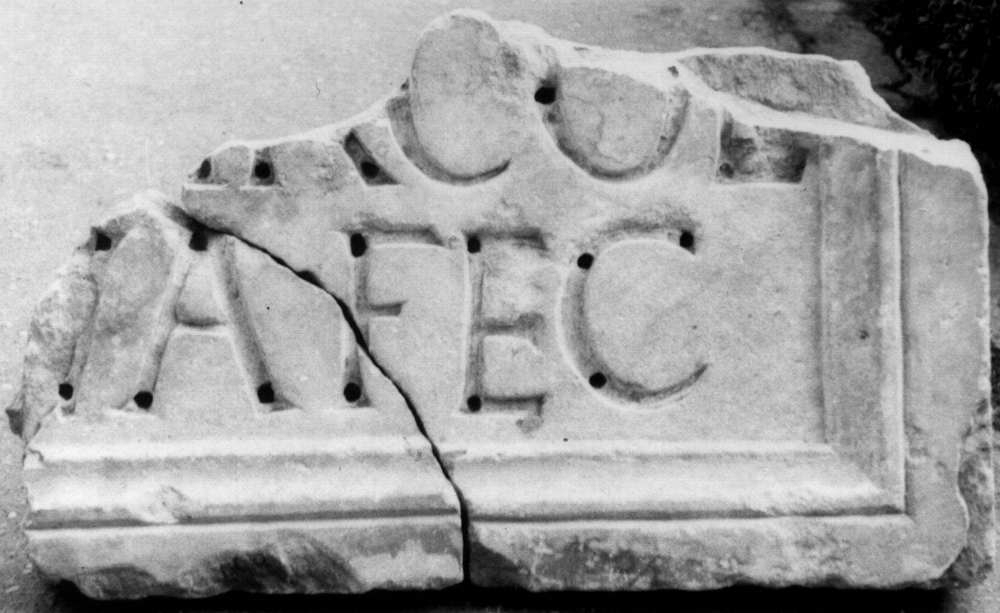

# EDH HD038658. Apulum

**Країна.** Румунія

**Провінція (код EDH).** Dac

**Місце знахідки (антична назва).** Apulum

**Сучасна назва.** Alba Iulia

**Деталі знахідки.** Festung, {Báthory-Kirche}, sekundär verwendet

**Координати.** 46.068786971,23.571510313

**Рік знахідки.** 1898

**Зберігання.** Alba Iulia, Muz. Unirii

**Датування (роки, від'ємні до н. е.).** 180 … 270

**Матеріал.** Marmor

**Тип пам'ятки.** Tafel

**Розміри (висота, ширина, глибина, см).** -39.0 × -65.0 × 10.5

## Текст (латинь, скорочення розкрито)

```
$] / [--- IIv]ir col(oniae) / [pecunia s]ua fec(it)
```

## Текст у вихідному записі

```
] / [ ]IR COL / [ ]VA FEC
```

## Коментар

Rechter unterer Teil einer Tafel. Schreibtechnik: litterae aureae (in Buchstabenbettungen); erhalten sind jedoch nur die Buchstabenbettungen.

## Література

IDR 3, 5, 404; Foto u. Zeichnung.
- CIL 03, 14483. #

## Фото



Джерело https://edh.ub.uni-heidelberg.de/edh/inschrift/HD038658, ліцензія CC BY-SA 4.0. Оригінальний XML в архіві сирі_дані/edh_xml.zip
