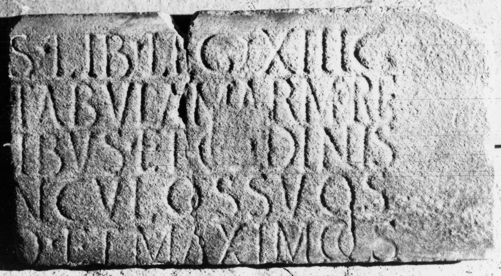

# EDH HD038660. Apulum

**Країна.** Румунія

**Провінція (код EDH).** Dac

**Місце знахідки (антична назва).** Apulum

**Сучасна назва.** Alba Iulia

**Деталі знахідки.** {Festung}

**Координати.** 46.068288248,23.571209907

**Зберігання.** Alba Iulia, Muz. Unirii

**Датування (роки, від'ємні до н. е.).** 227 … 253

**Матеріал.** Marmor

**Тип пам'ятки.** Tafel

**Розміри (висота, ширина, глибина, см).** -5.5 × -9.3 × 1.5

## Текст (латинь, скорочення розкрито)

```
[---]s lib(rarius) leg(ionis) XIII g(eminae) / [---] tabula marmorea / [---]libus et o[r]dinis / [--- commanu?]nculos suos / [---]o et Maximo co(n)s(ulibus)
```

## Текст у вихідному записі

```
[ ]S LIB LEG XIII G / [ ] TABVLA MARMOREA / [ ]LIBVS ET O[ ]DINIS / [ ]NCVLOS SVOS / [ ]O ET MAXIMO COS
```

## Коментар

Zwei aneinanderpassende Fragmente des rechten Teiles einer Tafel. Datierung: IDR 3, 5: Maximo cos.: 227, 232 oder 253 n. Chr.

## Література

IDR 3, 5, 406; Foto.
- CIL 03, 01205. #

## Фото



Джерело https://edh.ub.uni-heidelberg.de/edh/inschrift/HD038660, ліцензія CC BY-SA 4.0. Оригінальний XML в архіві сирі_дані/edh_xml.zip
