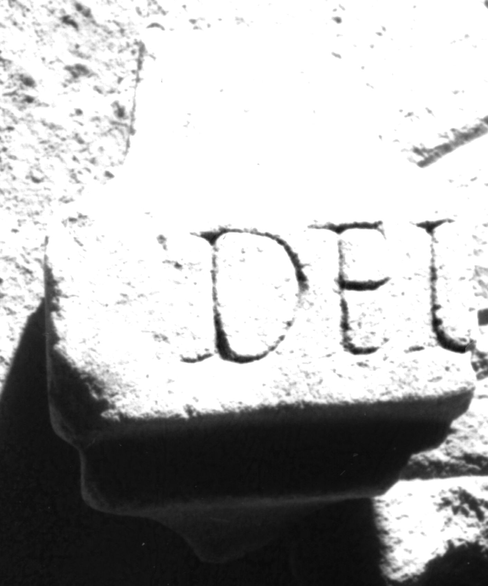

# EDH HD038676. Apulum

**Країна.** Румунія

**Провінція (код EDH).** Dac

**Місце знахідки (антична назва).** Apulum

**Сучасна назва.** Alba Iulia

**Деталі знахідки.** Praetorium des Statthalters

**Координати.** 46.076691,23.580099

**Зберігання.** Alba Iulia, Muz. Unirii

**Датування (роки, від'ємні до н. е.).** 201 … 275

**Матеріал.** Marmor

**Тип пам'ятки.** Altar?

**Розміри (висота, ширина, глибина, см).** -11.0 × -9.0 × -6.0

## Текст (латинь, скорочення розкрито)

```
Ded[icatum ---]
```

## Текст у вихідному записі

```
DED[ ]
```

## Коментар

Wohl linke obere Ecke der corona eines Altars.

## Література

IDR 3, 5, 416; Foto u. Zeichnung. #

## Фото



Джерело https://edh.ub.uni-heidelberg.de/edh/inschrift/HD038676, ліцензія CC BY-SA 4.0. Оригінальний XML в архіві сирі_дані/edh_xml.zip
