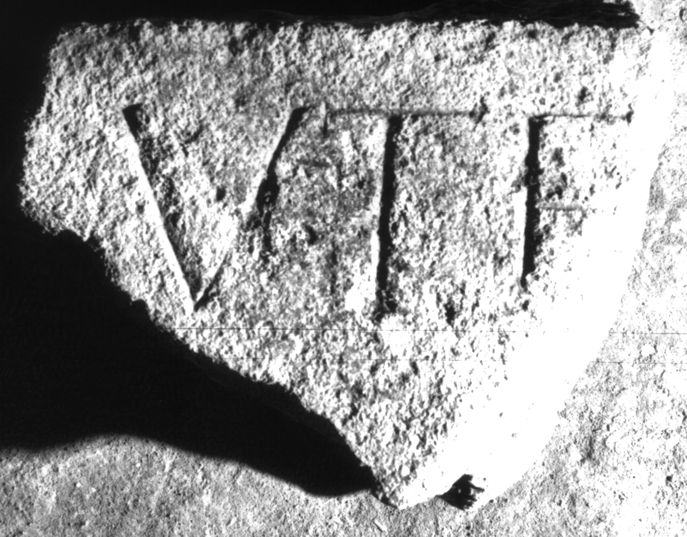

# EDH HD038698. Apulum

**Країна.** Румунія

**Провінція (код EDH).** Dac

**Місце знахідки (антична назва).** Apulum

**Сучасна назва.** Alba Iulia

**Деталі знахідки.** {Partoş}

**Координати.** 46.0463184,23.566650100

**Зберігання.** Alba Iulia, Muz. Unirii

**Датування (роки, від'ємні до н. е.).** 107 … 275

**Матеріал.** Kalkstein

**Тип пам'ятки.** Tafel

**Розміри (висота, ширина, глибина, см).** -18.0 × -23.0 × 9.0

## Текст (латинь, скорочення розкрито)

```
[--- pro sa]lute [---] / [&
```

## Текст у вихідному записі

```
[ ]LVTE [ ] / [
```

## Коментар

Oberer Teil des Inschriffeldes erhalten.

## Література

IDR 3, 5, 418; Foto u. Zeichnung. #

## Фото



Джерело https://edh.ub.uni-heidelberg.de/edh/inschrift/HD038698, ліцензія CC BY-SA 4.0. Оригінальний XML в архіві сирі_дані/edh_xml.zip
