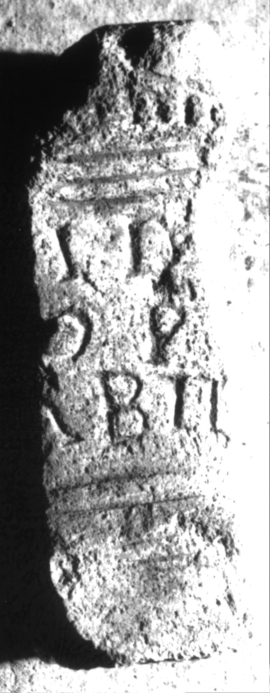
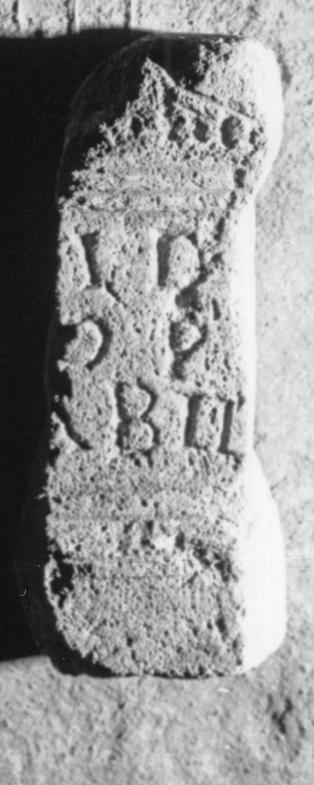

# EDH HD038699. Apulum

**Країна.** Румунія

**Провінція (код EDH).** Dac

**Місце знахідки (антична назва).** Apulum

**Сучасна назва.** Alba Iulia

**Деталі знахідки.** {Platoul Romanilor}

**Координати.** 46.0724587,23.556527400

**Зберігання.** Alba Iulia, Muz. Unirii

**Датування (роки, від'ємні до н. е.).** 107 … 275

**Матеріал.** Kalkstein

**Тип пам'ятки.** Altar

**Розміри (висота, ширина, глибина, см).** -18.0 × -7.0 × -10.0

## Текст (латинь, скорочення розкрито)

```
[---]ID / [---]OP / [---]abil(is)
```

## Текст у вихідному записі

```
[ ]ID / [ ]OP / [ ]ABIL
```

## Література

IDR 3, 5, 419; Foto. #

## Фото





Джерело https://edh.ub.uni-heidelberg.de/edh/inschrift/HD038699, ліцензія CC BY-SA 4.0. Оригінальний XML в архіві сирі_дані/edh_xml.zip
