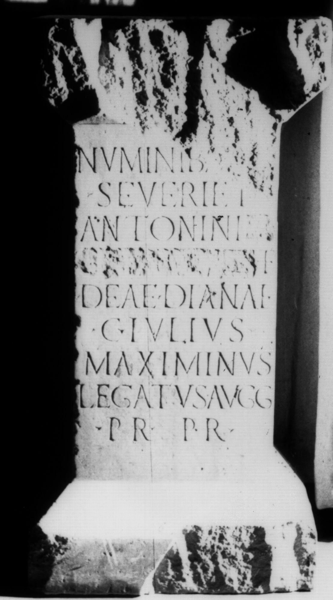

# EDH HD038707. Apulum

**Країна.** Румунія

**Провінція (код EDH).** Dac

**Місце знахідки (антична назва).** Apulum

**Сучасна назва.** Alba Iulia

**Деталі знахідки.** {Festung}

**Координати.** 46.068288248,23.571209907

**Зберігання.** Alba Iulia, Muz. Unirii

**Датування (роки, від'ємні до н. е.).** 208 … 210

**Матеріал.** Marmor

**Тип пам'ятки.** Statuenbasis

**Розміри (висота, ширина, глибина, см).** 96.0 × 50.0 × 39.0

## Текст (латинь, скорочення розкрито)

```
Numinib(us) A[ugg(ustorum)] / Severi et / Antonini [[et]] / [[Getae Cae]]s(aris) et / deae Dianae / C(aius) Iulius / Maximinus / leg(atus) Augg(ustorum) / pr(o) pr(aetore)
```

## Текст у вихідному записі

```
NVMINIB A[ ] / SEVERI ET / ANTONINI [[ET]] / [[GETAE CAE]]S ET / DEAE DIANAE / C IVLIVS / MAXIMINVS / LEG AVGG / PR PR
```

## Коментар

Bekrönung und rechter oberer Teil des Inschriftfeldes stark verwittert. Z. 3/4: Der Name von Geta wurde eradiert.

## Література

IDR 3, 5, 427; Foto u. Zeichnung.
- CIL 03, 01127. #

## Фото



Джерело https://edh.ub.uni-heidelberg.de/edh/inschrift/HD038707, ліцензія CC BY-SA 4.0. Оригінальний XML в архіві сирі_дані/edh_xml.zip
