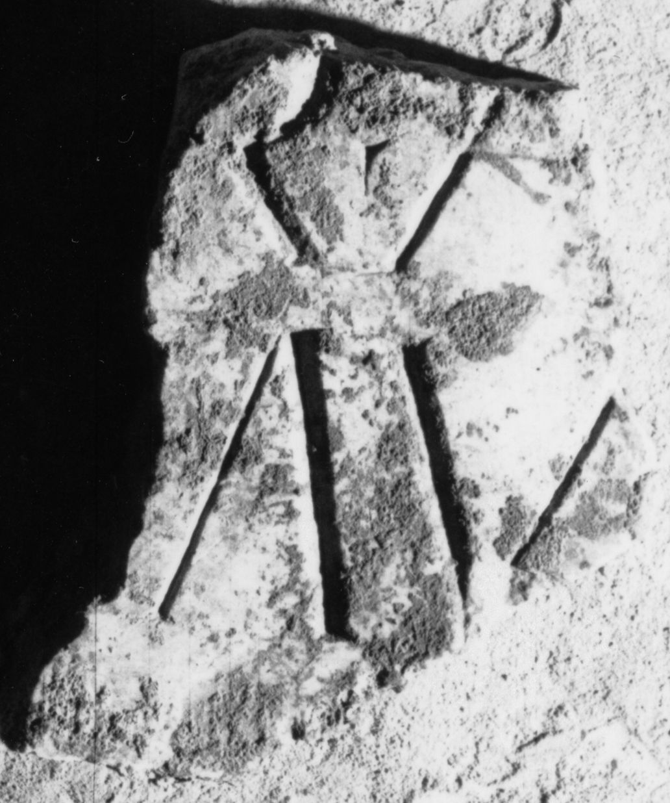

# EDH HD038708. Apulum

**Країна.** Румунія

**Провінція (код EDH).** Dac

**Місце знахідки (антична назва).** Apulum

**Сучасна назва.** Alba Iulia

**Координати.** 46.0669444,23.569999999

**Зберігання.** Alba Iulia, Muz. Unirii

**Датування (роки, від'ємні до н. е.).** 201 … 275

**Матеріал.** Marmor

**Тип пам'ятки.** Tafel

**Розміри (висота, ширина, глибина, см).** -18.0 × -13.0 × 2.8

## Текст (латинь, скорочення розкрито)

```
$] / [---? M(arci)? Au?]r(eli) A[ntonini] / [Pii? Felici?]s Aug(usti) / [&
```

## Текст у вихідному записі

```
] / [ ]R A[ ] / [ ]S AVG / [
```

## Коментар

Reste roter Farbe in den Buchstaben. Lesungs- und Ergänzungsvorschlag nach IDR III. Datierung: 198-217 n. Chr., wenn es sich um Kaiser Caracalla handelt.

## Література

IDR 3, 5, 428; Foto u. Zeichnung. #

## Фото



Джерело https://edh.ub.uni-heidelberg.de/edh/inschrift/HD038708, ліцензія CC BY-SA 4.0. Оригінальний XML в архіві сирі_дані/edh_xml.zip
