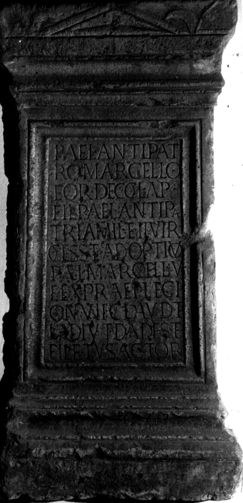

# EDH HD038730. Apulum

**Країна.** Румунія

**Провінція (код EDH).** Dac

**Місце знахідки (антична назва).** Apulum

**Сучасна назва.** Alba Iulia

**Деталі знахідки.** {Festung}

**Координати.** 46.068288248,23.571209907

**Зберігання.** Wien, Nationalbibl.

**Датування (роки, від'ємні до н. е.).** 201 … 275

**Матеріал.** Kalkstein

**Тип пам'ятки.** Statuenbasis

## Текст (латинь, скорочення розкрито)

```
P(ublio) Ael(io) Antipat/ro Marcello / eq(uiti) R(omano) dec(urioni) col(oniae) Ap(ulensis) / fil(io) P(ubli) Ael(i) Antipa/tri a mil(itiis) et IIvir(i) / col(oniae) s(upra) s(criptae) et adoptivo / P(ubli) Ael(i) Marcelli v(iri) / e(gregii) ex praef(ecto) legi/on(um) VII Claud(iae) et / I adiut(ricis) Dades et / Filetus actor(es)
```

## Текст у вихідному записі

```
P AEL ANTIPAT / RO MARCELLO / EQ R DEC COL AP / FIL P AEL ANTIPA / TRI A MIL ET IIVIR / COL S S ET ADOPTIVO / P AEL MARCELLI V / E EX PRAEF LEGI / ON VII CLAVD ET / I ADIVT DADES ET / FILETVS ACTOR
```

## Коментар

Autopsie: Buonopane, 2009.

## Література

IDR 3, 5, 439; Foto.
- CIL 03, 01181.
- A. Buonopane - V. La Monaca, in: G.P. Marchi - J. Pál (Hrsg.), Epigrafi romane di Transilvania. Bibliotheca Capitolare di Verona, Manoscritto CCLXVII (Verona - Szeged 2010) 269, Nr. 16; Foto u. Zeichnung.
- F. Beutler - E. Weber (Hrsg.), Die römischen Inschriften der Österreichischen Nationalbibliothek (Wien 2015) 22, Nr. 6; Foto. #

## Фото



Джерело https://edh.ub.uni-heidelberg.de/edh/inschrift/HD038730, ліцензія CC BY-SA 4.0. Оригінальний XML в архіві сирі_дані/edh_xml.zip
