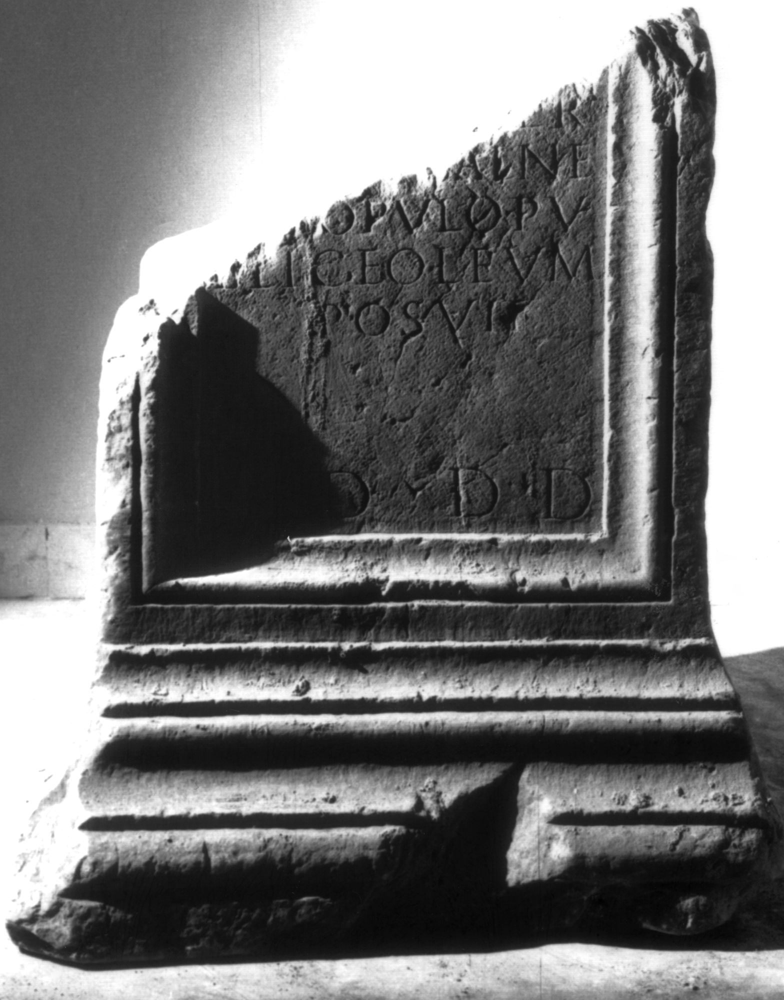

# EDH HD038753. Apulum

**Країна.** Румунія

**Провінція (код EDH).** Dac

**Місце знахідки (антична назва).** Apulum

**Сучасна назва.** Alba Iulia

**Деталі знахідки.** {Partoş}

**Координати.** 46.0463184,23.566650100

**Зберігання.** Alba Iulia, Muz. Unirii

**Датування (роки, від'ємні до н. е.).** 161 … 180

**Матеріал.** Marmor

**Тип пам'ятки.** Statuenbasis

**Розміри (висота, ширина, глибина, см).** -120.0 × -75.0 × -60.0

## Текст (латинь, скорочення розкрито)

```
C(aio) Cervoni[o] / Pap(iria) Sabino q(uin)[q(uennali)] / col(oniae) Dac(icae) dec(urioni) mun[i]/[c]ipi(i) Apul(ensis) patron(o) / [c]ollegi(i) fabr(um) col(oniae) / [et m]unicipi(i) s(upra) s(criptorum) pa/[tro]no causarum / [piis?]simo am[ico] / rarissim[o] / Sex(tus) Sentinas Maxi/mus anno primo / [f]acti municipi(i) / posuit // [ob] cuius / [sta]tuae dedi/[cat]ionem Lu/[ci]a Iulia uxor / [C]ervoni(i) per / omnes balne/[as] populo pu/blice oleum / posuit / l(oco) d(ato) d(ecurionum) d(ecreto)
```

## Текст у вихідному записі

```
C CERVONI[ ] / PAP SABINO Q[ ] / COL DAC DEC MVN[ ] / [ ]IPI APVL PATRON / [ ]OLLEGI FABR COL / [ ]VNICIPI S S PA / [ ]NO CAVSARVM / [ ]SIMO AM[ ] / RARISSIM[ ] / SEX SENTINAS MAXI / MVS ANNO PRIMO / [ ]ACTI MVNICIPI / POSVIT / / [ ] CVIVS / [ ]TVAE DEDI / [ ]IONEM LV / [ ]A IVLIA VXOR / [ ]ERVONI PER / OMNES BALNE / [ ] POPVLO PV / BLICE OLEVM / POSVIT / L D D D
```

## Коментар

Zwei aneinanderpassende Fragmente erhalten; zwei kleine Fragmente des unteren Teils gingen nach der Entdeckung verschollen. Die Inschrift verteilt sich auf die Vorder- und die rechte Nebenseite. (B): Ota - Băeştean: Nebenseite: Z. 5: [C]erunoni(i).

## Література

AE 1996, 1276.
- AE 2010, 1376.
- CIL 03, 07805.
- ILS 7145.
- IDR 3, 5, 446; Foto u. Zeichnung.
- I. Piso, SpNov 11, 1995, 155-162; Abb. 1a u. 1b; Abb. 1c u. 1d (Zeichnungen). - AE 1996.
- R. Ota - G. Băeştean, Dacia 54, 2010, 132. (B) - AE 2010. #

## Фото



Джерело https://edh.ub.uni-heidelberg.de/edh/inschrift/HD038753, ліцензія CC BY-SA 4.0. Оригінальний XML в архіві сирі_дані/edh_xml.zip
