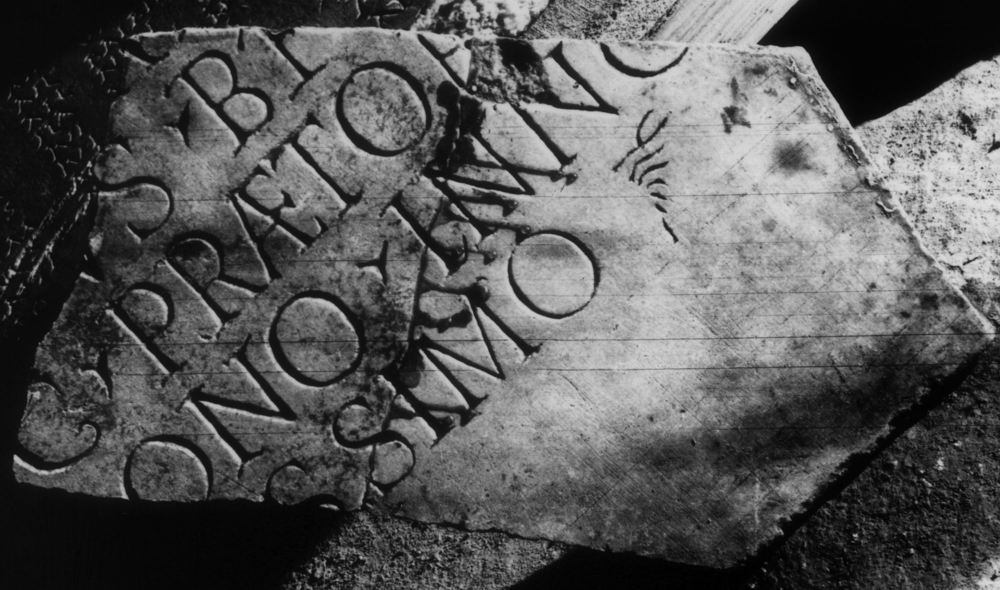

# EDH HD038755. Apulum

**Країна.** Румунія

**Провінція (код EDH).** Dac

**Місце знахідки (антична назва).** Apulum

**Сучасна назва.** Alba Iulia

**Деталі знахідки.** Praetorium des Statthalters

**Координати.** 46.076691,23.580099

**Зберігання.** Alba Iulia, Muz. Unirii

**Датування (роки, від'ємні до н. е.).** 106 … 117

**Матеріал.** Marmor

**Тип пам'ятки.** Tafel

**Розміри (висота, ширина, глибина, см).** -36.0 × -40.0 × 2.2

## Текст (латинь, скорочення розкрито)

```
$] / [--- Au?]re(?)[lius] / [---]us b(ene)f(iciarius) [leg(ati)] / [Au]g(usti) praetor[ii] / [patr]ono inno/[centi]ssimo
```

## Текст у вихідному записі

```
] / [ ]RE[ ] / [ ]VS BF [ ] / [ ]G PRAETOR[ ] / [ ]ONO INNO / [ ]SSIMO
```

## Коментар

Zwei aneinanderpassende Fragmente erhalten. Z. 6 (Ende): hedera.

## Література

IDR 3, 5, 449; Foto u. Zeichnung.
- CIL 03, 14480. #

## Фото



Джерело https://edh.ub.uni-heidelberg.de/edh/inschrift/HD038755, ліцензія CC BY-SA 4.0. Оригінальний XML в архіві сирі_дані/edh_xml.zip
