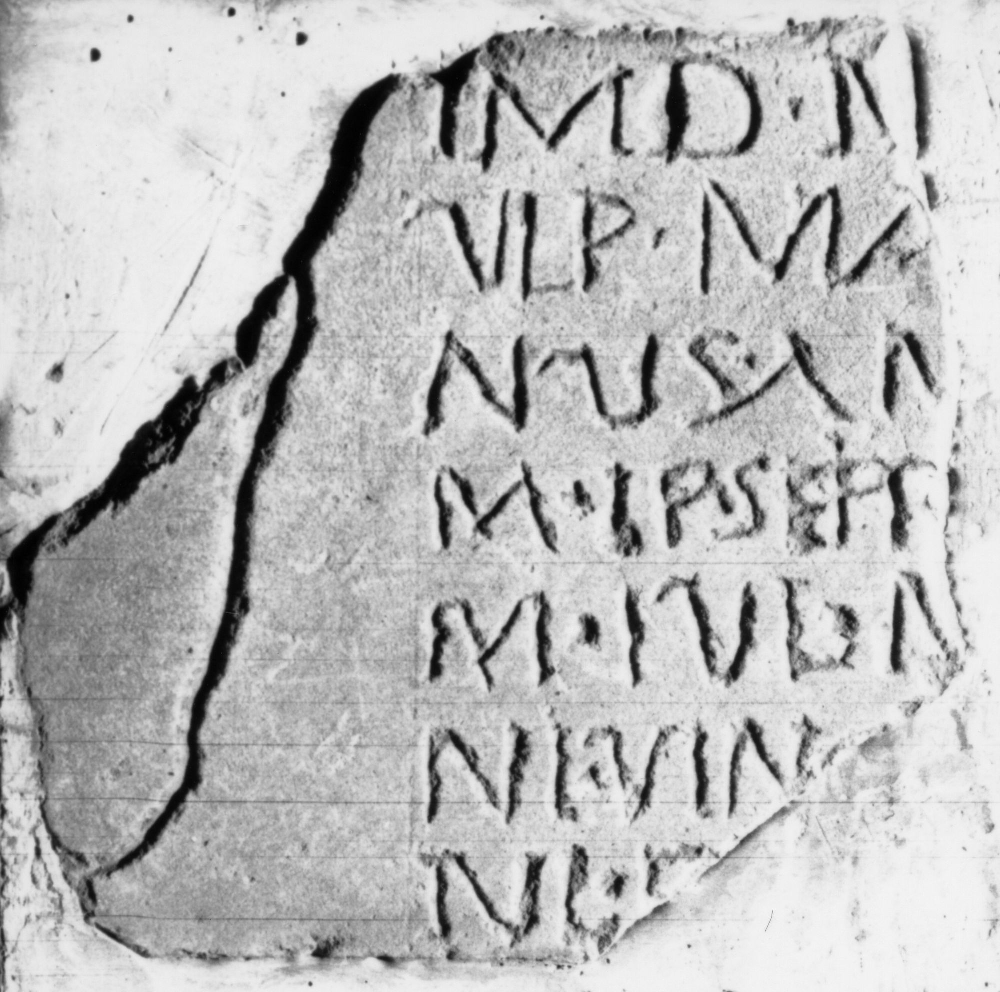

# EDH HD038785. Apulum

**Країна.** Румунія

**Провінція (код EDH).** Dac

**Місце знахідки (антична назва).** Apulum

**Сучасна назва.** Alba Iulia

**Деталі знахідки.** {Festung}

**Координати.** 46.068288248,23.571209907

**Рік знахідки.** 1892

**Зберігання.** Alba Iulia, Muz. Unirii

**Датування (роки, від'ємні до н. е.).** 171 … 275

**Матеріал.** Kalkstein

**Тип пам'ятки.** Tafel

**Розміри (висота, ширина, глибина, см).** -25.0 × -25.0 × 2.0

## Текст (латинь, скорочення розкрито)

```
$] / IMD N(?)[---] / Ulp(ius) Ma[---]/nus An[---] / M(arcus) Ip(---) Sept[imus ---] / M(arcus) Iul(ius) M(?)[---] / Iul(ius) Vinc[---] / Iul(ius) P(?)[---] / [&
```

## Текст у вихідному записі

```
] / IMD N[ ] / VLP MA[ ] / NVS AN[ ] / M IP SEPT[ ] / M IVL M[ ] / IVL VINC[ ] / IVL P[ ] / [
```

## Література

IDR 3, 5, 457; Foto.
- CIL 03, 12559. #

## Фото



Джерело https://edh.ub.uni-heidelberg.de/edh/inschrift/HD038785, ліцензія CC BY-SA 4.0. Оригінальний XML в архіві сирі_дані/edh_xml.zip
