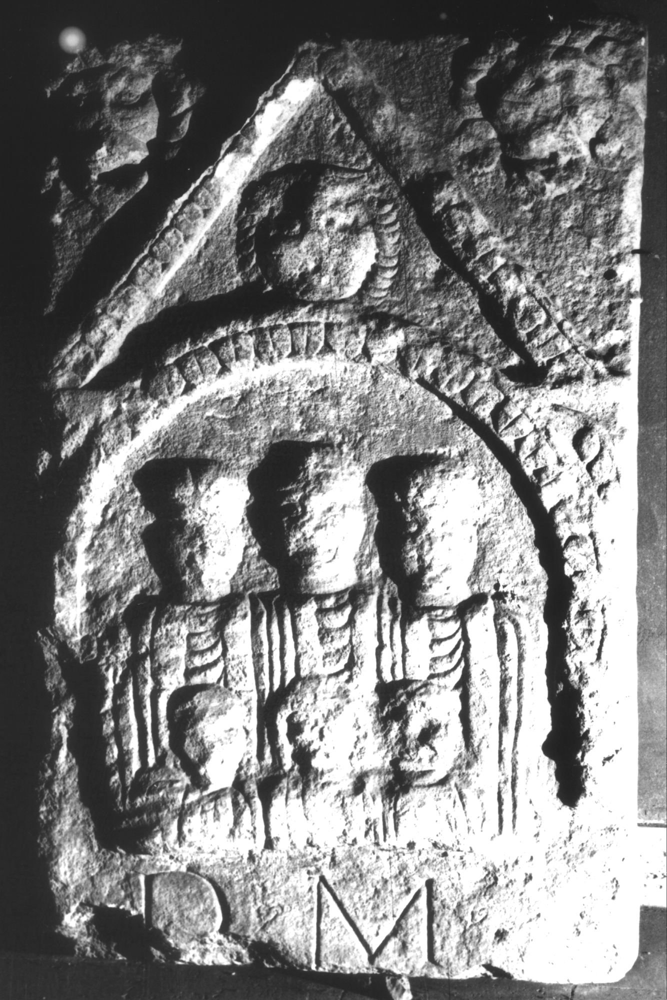

# EDH HD038794. Apulum

**Країна.** Румунія

**Провінція (код EDH).** Dac

**Місце знахідки (антична назва).** Apulum

**Сучасна назва.** Alba Iulia

**Координати.** 46.0669444,23.569999999

**Зберігання.** Alba Iulia, Muz. Unirii

**Датування (роки, від'ємні до н. е.).** 106 … 200

**Матеріал.** Kalkstein

**Тип пам'ятки.** Stele

**Розміри (висота, ширина, глибина, см).** -110.0 × -68.0 × 23.0

## Текст (латинь, скорочення розкрито)

```
D(is) M(anibus) / [&
```

## Текст у вихідному записі

```
D M / [
```

## Коментар

Oberer Teil einer Stele. Reliefdarstellung eines Frontgiebels mit Löwen- und Medusaköpfen. Unter dem Giebel und innerhalb einer Nische die Büsten von drei Erwachsenen und drei Kindern. Z. 1: hedera.

## Література

IDR 3, 5, 461; Foto. #

## Фото



Джерело https://edh.ub.uni-heidelberg.de/edh/inschrift/HD038794, ліцензія CC BY-SA 4.0. Оригінальний XML в архіві сирі_дані/edh_xml.zip
