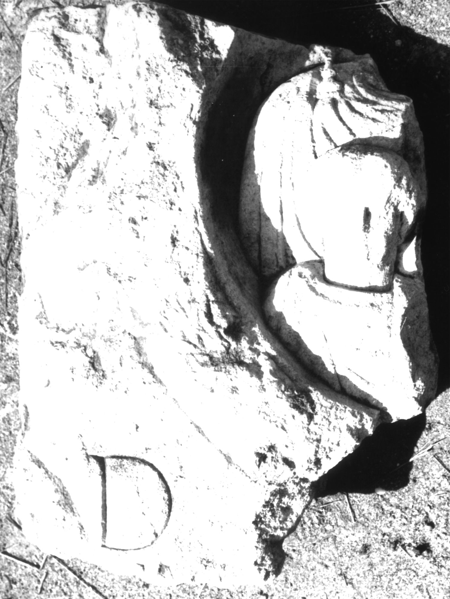

# EDH HD038803. Apulum

**Країна.** Румунія

**Провінція (код EDH).** Dac

**Місце знахідки (антична назва).** Apulum

**Сучасна назва.** Alba Iulia

**Деталі знахідки.** Tolstoi, {nordwestliche römische Nekropole}, bei, sekundär verwendet

**Координати.** 46.079325595,23.563780440

**Зберігання.** Alba Iulia, Muz. Unirii

**Датування (роки, від'ємні до н. е.).** 151 … 230

**Матеріал.** Kalkstein

**Тип пам'ятки.** Stele

**Розміри (висота, ширина, глибина, см).** -61.0 × -47.0 × 10.0

## Текст (латинь, скорочення розкрито)

```
D(is) [M(anibus)] / Cu[---] / [&
```

## Текст у вихідному записі

```
D [ ] / CV[ ] / [
```

## Коментар

Rechts oberhalb des Buchstaben D noch der linke untere Teil eines Kranzes mit den Büsten eines Kindes und einer Frau erhalten.

## Література

IDR 3, 5, 466; Foto u. Zeichnung. #

## Фото



Джерело https://edh.ub.uni-heidelberg.de/edh/inschrift/HD038803, ліцензія CC BY-SA 4.0. Оригінальний XML в архіві сирі_дані/edh_xml.zip
