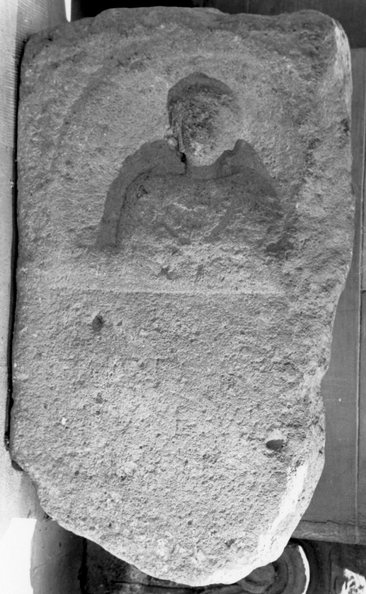

# EDH HD038808. Apulum

**Країна.** Румунія

**Провінція (код EDH).** Dac

**Місце знахідки (антична назва).** Apulum

**Сучасна назва.** Alba Iulia

**Координати.** 46.0669444,23.569999999

**Зберігання.** Alba Iulia, Muz. Unirii

**Датування (роки, від'ємні до н. е.).** 151 … 275

**Матеріал.** Kalkstein

**Тип пам'ятки.** Stele

**Розміри (висота, ширина, глибина, см).** -105.0 × -63.0 × -22.0

## Текст (латинь, скорочення розкрито)

```
D(is) M(anibus) / [---]ict[---] / [---]V[-]E vix(it) / [---]I[---] / [&
```

## Текст у вихідному записі

```
D M / [ ]ICT[ ] / [ ]V[ ]E VIX / [ ]I[ ] / [
```

## Коментар

Oberhalb des Inschriftfeldes Nische mit einer Büste.

## Література

IDR 3, 5, 469; Zeichnung. #

## Фото



Джерело https://edh.ub.uni-heidelberg.de/edh/inschrift/HD038808, ліцензія CC BY-SA 4.0. Оригінальний XML в архіві сирі_дані/edh_xml.zip
