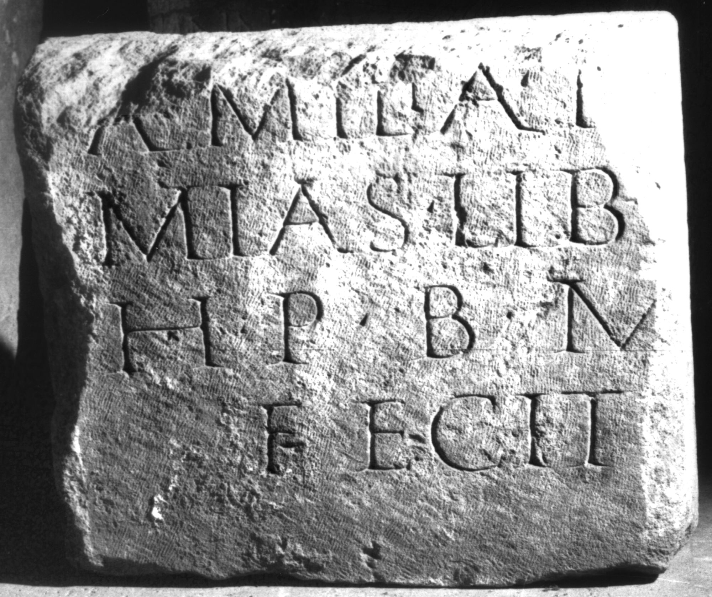

# EDH HD038866. Apulum

**Країна.** Румунія

**Провінція (код EDH).** Dac

**Місце знахідки (антична назва).** Apulum

**Сучасна назва.** Alba Iulia

**Координати.** 46.0669444,23.569999999

**Зберігання.** Alba Iulia, Muz. Unirii

**Датування (роки, від'ємні до н. е.).** 171 … 275

**Матеріал.** Kalkstein

**Розміри (висота, ширина, глибина, см).** -58.0 × -49.0 × -20.0

## Текст (латинь, скорочення розкрито)

```
$] / Aemilia H[er?]/mias lib(erta) [et] / h(eres) p(atron-) b(ene) m(erenti) / fecit
```

## Текст у вихідному записі

```
] / AEMILIA H[ ] / MIAS LIB [ ] / H P B M / FECIT
```

## Коментар

Z. 1/2: Ergänzungsvorschlag nach IDR 3, 5.

## Література

IDR 3, 5, 490; Foto u. Zeichnung. #

## Фото



Джерело https://edh.ub.uni-heidelberg.de/edh/inschrift/HD038866, ліцензія CC BY-SA 4.0. Оригінальний XML в архіві сирі_дані/edh_xml.zip
