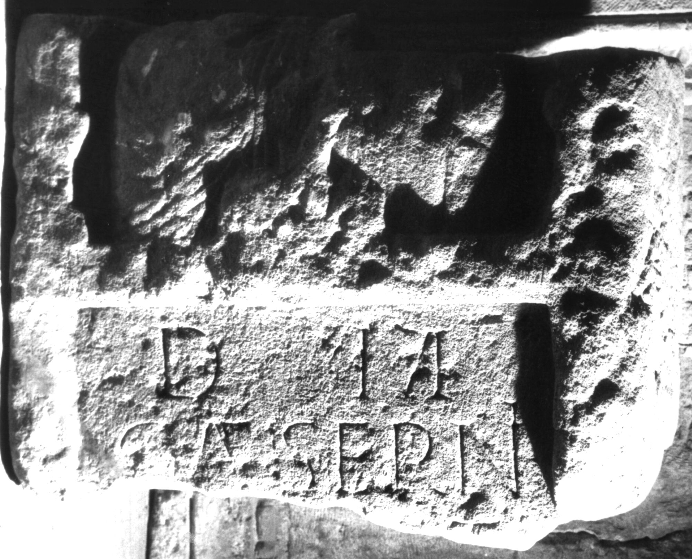

# EDH HD038867. Apulum

**Країна.** Румунія

**Провінція (код EDH).** Dac

**Місце знахідки (антична назва).** Apulum

**Сучасна назва.** Alba Iulia

**Деталі знахідки.** {Platoul Romanilor}

**Координати.** 46.0724587,23.556527400

**Зберігання.** Alba Iulia, Muz. Unirii

**Датування (роки, від'ємні до н. е.).** 151 … 275

**Матеріал.** Sandstein

**Тип пам'ятки.** Stele

**Розміри (висота, ширина, глибина, см).** -46.0 × -62.0 × -22.0

## Текст (латинь, скорочення розкрито)

```
D(is) M(anibus) / C(ai) Aeserni / [---]E(?)T / [&
```

## Текст у вихідному записі

```
D M / C AESERNI / [ ]ET / [
```

## Коментар

Oberhalb des Inschriftfeldes Nische mit den Büsten zweier Erwachsener und eines Kindes. Z. 3: vom E(?) nur die obere Querhaste erhalten.

## Література

IDR 3, 5, 491; Foto u. Zeichnung. #

## Фото



Джерело https://edh.ub.uni-heidelberg.de/edh/inschrift/HD038867, ліцензія CC BY-SA 4.0. Оригінальний XML в архіві сирі_дані/edh_xml.zip
