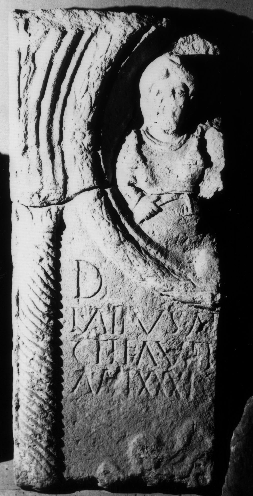

# EDH HD038873. Apulum

**Країна.** Румунія

**Провінція (код EDH).** Dac

**Місце знахідки (антична назва).** Apulum

**Сучасна назва.** Alba Iulia

**Деталі знахідки.** Festung, {Báthory-Kirche}, sekundär verwendet

**Координати.** 46.068786971,23.571510313

**Зберігання.** Alba Iulia, Muz. Unirii

**Датування (роки, від'ємні до н. е.).** 151 … 200

**Матеріал.** Sandstein

**Тип пам'ятки.** Stele

**Розміри (висота, ширина, глибина, см).** -123.0 × -52.0 × 15.0

## Текст (латинь, скорочення розкрито)

```
D(is) [M(anibus)] / L(ucius) Atius At[---] / C<e=F>l<e=F>ia#C<e>l<e>ia#CFLFIA vet(eranus) [--- vix(it)] / an(nos) LXXXI C[---](?)
```

## Текст у вихідному записі

```
D [ ] / L ATIVS AT[ ] / CFLFIA VET [ ] / AN LXXXI C[ ]
```

## Коментар

Oberhalb des Inschriftfeldes linker Teil eines Medaillons mit Darstellung einer Frau mit Haube, Halskette, Fibeln und Gürtel. Sie trägt einen Schlüssel in ihrer rechten Hand. Inschriftfeld und unterer Teil des Medaillons ursprünglich von zwei tordierten Halbsäulen eingefaßt, von denen nur noch ein Teil der linken erhalten ist. Buchstabe A ohne Querhaste. Z. 3: EI-Ligatur.

## Література

IDR 3, 5, 499; Foto u. Zeichnung.
- CIL 03, 14481.
- E. Weber, in: L. Ruscu - C. Ciongradi - R. Ardevan - C. Roman - C. Găzdac (Hrsg.), Orbis Antiquus. Studia in honorem Ioannis Pisonis (Cluj-Napoca 2004) 818. - AE 2004.
- AE 2004, 1181. #

## Фото



Джерело https://edh.ub.uni-heidelberg.de/edh/inschrift/HD038873, ліцензія CC BY-SA 4.0. Оригінальний XML в архіві сирі_дані/edh_xml.zip
