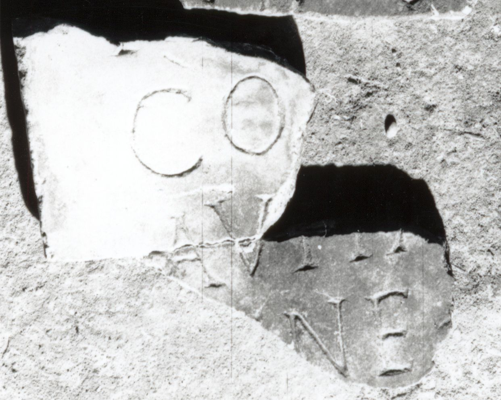

# EDH HD038875. Apulum

**Країна.** Румунія

**Провінція (код EDH).** Dac

**Місце знахідки (антична назва).** Apulum

**Сучасна назва.** Alba Iulia

**Координати.** 46.0669444,23.569999999

**Зберігання.** Alba Iulia, Muz. Unirii

**Датування (роки, від'ємні до н. е.).** 151 … 270

**Матеріал.** Marmor

**Тип пам'ятки.** Tafel

## Текст (латинь, скорочення розкрито)

```
$] / I[---] / CO[---]AI / Avita [co]niu[gi](?) / [b]ene [merenti] / [------] // [---?]M[---?] // [---?]MI[---?]
```

## Текст у вихідному записі

```
] / I[ ] / CO[ ]AI / AVITA [ ]NIV[ ] / [ ]ENE [ ] / [ ] / / [ ]M[ ] / / [ ]MI[ ]
```

## Коментар

Vier Fragmente einer Tafel. Maße: a: 18 x 20 x 2 cm; b: 7 x 9.5 x 2 cm; c: 7 x 5 x 2 cm; d: 5 x 7 x 2 cm. Fragment a ist in zwei Teile gebrochen.

## Література

IDR 3, 5, 501; Foto u. Zeichnung. #

## Фото



Джерело https://edh.ub.uni-heidelberg.de/edh/inschrift/HD038875, ліцензія CC BY-SA 4.0. Оригінальний XML в архіві сирі_дані/edh_xml.zip
