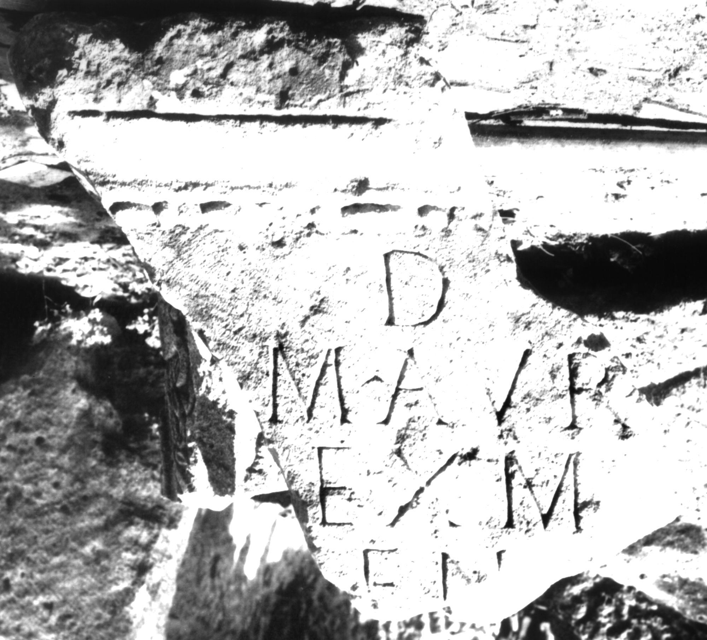

# EDH HD038876. Apulum

**Країна.** Румунія

**Провінція (код EDH).** Dac

**Місце знахідки (антична назва).** Apulum

**Сучасна назва.** Alba Iulia

**Деталі знахідки.** Tolstoi, {nordwestliche römische Nekropole}, bei, sekundär verwendet

**Координати.** 46.079325595,23.563780440

**Зберігання.** Alba Iulia, Muz. Unirii

**Датування (роки, від'ємні до н. е.).** 161 … 275

**Матеріал.** Kalkstein

**Тип пам'ятки.** Tafel

**Розміри (висота, ширина, глибина, см).** -59.0 × -44.0 × 28.0

## Текст (латинь, скорочення розкрито)

```
D(is) [M(anibus)] / M(arcus) Aur(elius) [--- vix(it) an(nis)] / [s]ex m[ens(ibus)? ---] / [--]ENT(?)[---] / [&
```

## Текст у вихідному записі

```
D [ ] / M AVR [ ] / [ ]EX M[ ] / [ ]ENT[ ] / [
```

## Коментар

Fragment einer Tafel. Gefunden in der Nekropole nordöstlich der Cetate.

## Література

IDR 3, 5, 502; Foto u. Zeichnung. #

## Фото



Джерело https://edh.ub.uni-heidelberg.de/edh/inschrift/HD038876, ліцензія CC BY-SA 4.0. Оригінальний XML в архіві сирі_дані/edh_xml.zip
