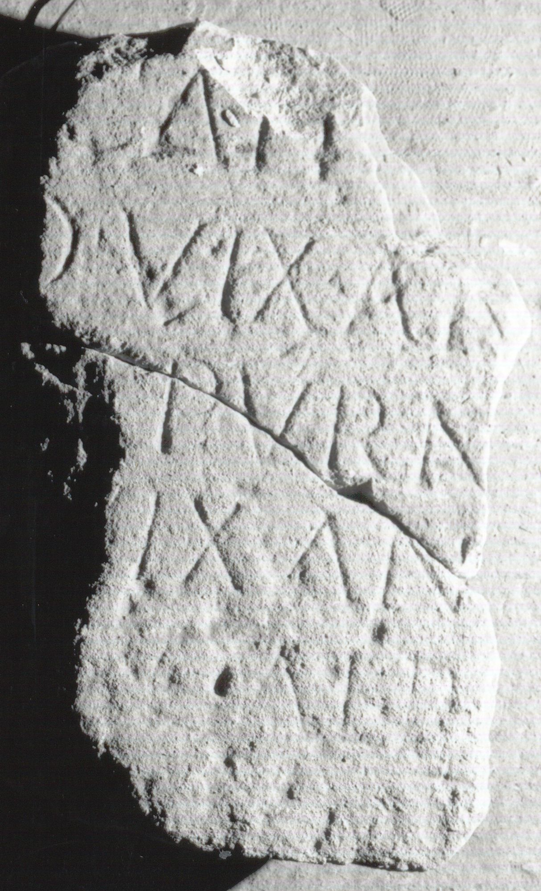

# EDH HD038882. Apulum

**Країна.** Румунія

**Провінція (код EDH).** Dac

**Місце знахідки (антична назва).** Apulum

**Сучасна назва.** Alba Iulia

**Деталі знахідки.** {Partoş}

**Координати.** 46.0463184,23.566650100

**Зберігання.** Alba Iulia, Muz. Unirii

**Датування (роки, від'ємні до н. е.).** 107 … 275

**Матеріал.** Kalkstein

**Тип пам'ятки.** Stele?

**Розміри (висота, ширина, глибина, см).** -60.0 × -25.0 × -15.0

## Текст (латинь, скорочення розкрито)

```
$] / [---] Calp[urnio] / [---]o vix(it) an(nis) [---] / [--- Ca]lpurn[io ---] / [---] vix(it) an(nis) [---] / [---] Calp[urnio?] / [&
```

## Текст у вихідному записі

```
] / [ ] CALP[ ] / [ ]O VIX AN [ ] / [ ]LPVRN[ ] / [ ] VIX AN [ ] / [ ] CALP[ ] / [
```

## Коментар

Fragment einer Stele oder Tafel. Z. 5: IDR 3, 5: Calp[urnio?, -ius?].

## Література

IDR 3, 5, 509; Foto u. Zeichnung. #

## Фото



Джерело https://edh.ub.uni-heidelberg.de/edh/inschrift/HD038882, ліцензія CC BY-SA 4.0. Оригінальний XML в архіві сирі_дані/edh_xml.zip
