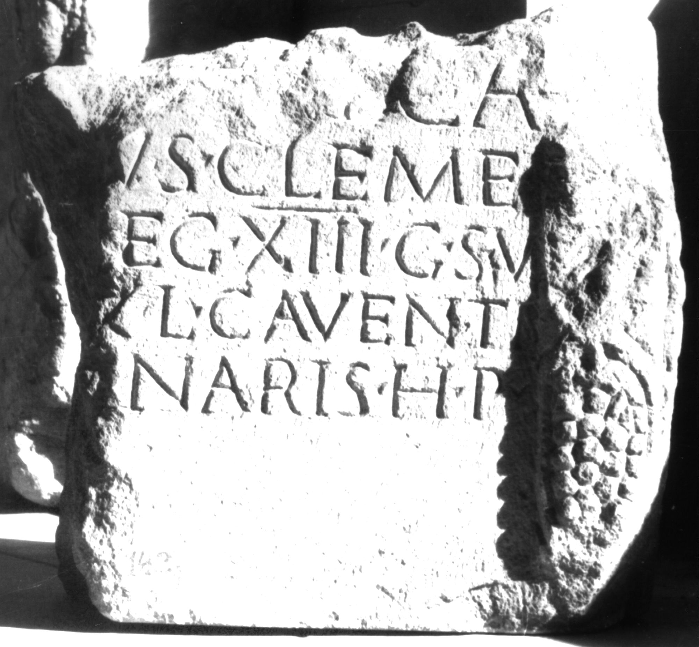
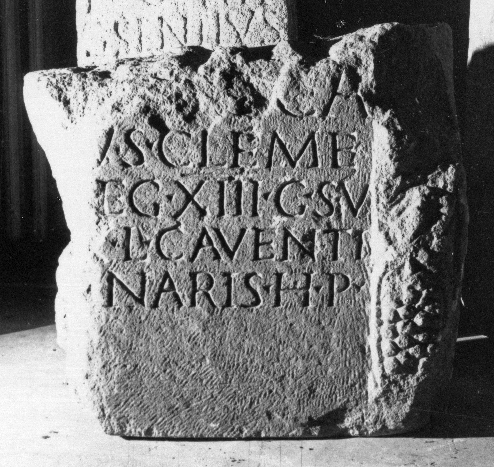

# EDH HD038884. Apulum

**Країна.** Румунія

**Провінція (код EDH).** Dac

**Місце знахідки (антична назва).** Apulum

**Сучасна назва.** Alba Iulia

**Координати.** 46.0669444,23.569999999

**Зберігання.** Alba Iulia, Muz. Unirii

**Датування (роки, від'ємні до н. е.).** 222 … 235

**Матеріал.** Kalkstein

**Розміри (висота, ширина, глибина, см).** -52.0 × -49.0 × -20.0

## Текст (латинь, скорочення розкрито)

```
$] / [---] L(ucius) Ca/[venti]us Cleme/[ns --- l]eg(ionis) XIII g(eminae) S(everianae) v(ixit) / [ann(is) -]V L(ucius) Caventi(us) / [Apolli?]naris h(eres) p(osuit)
```

## Текст у вихідному записі

```
] / [ ] L CA / [ ]VS CLEME / [ ]EG XIII G S V / [ ]V L CAVENTI / [ ]NARIS H P
```

## Коментар

Unterer rechter Teil einer Stele. Mögliche Reste von einer Halbsäule mit Traubenmotive erhalten.

## Література

IDR 3, 5, 511; Foto u. Zeichnung. #

## Фото





Джерело https://edh.ub.uni-heidelberg.de/edh/inschrift/HD038884, ліцензія CC BY-SA 4.0. Оригінальний XML в архіві сирі_дані/edh_xml.zip
