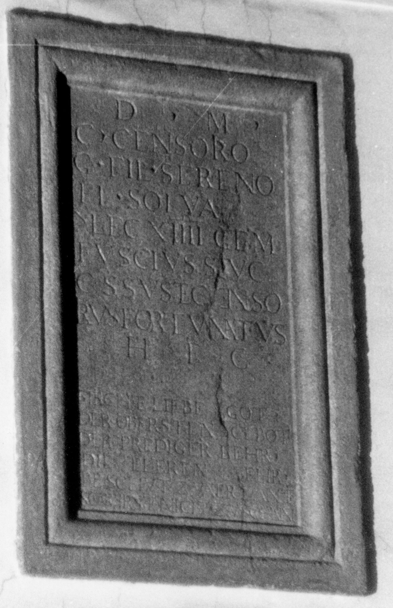
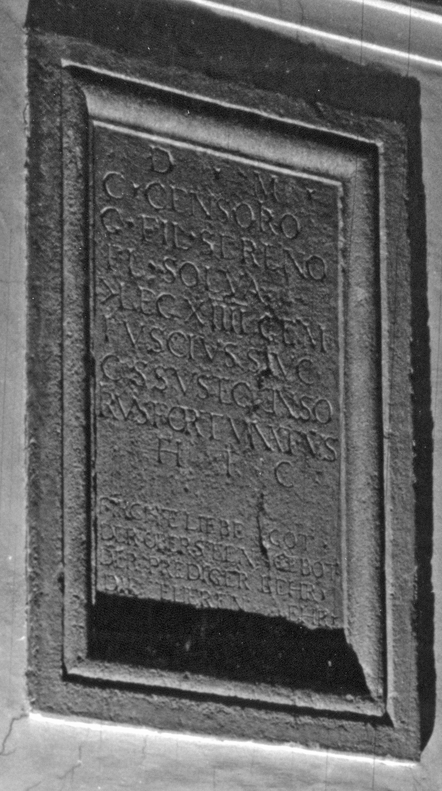

# EDH HD038886. Apulum, aus?

**Країна.** Румунія

**Провінція (код EDH).** Dac

**Місце знахідки (антична назва).** Apulum, aus?

**Сучасна назва.** Sibiu

**Деталі знахідки.** {Kathedrale}, bei

**Координати.** 45.794564045,24.148110151

**Зберігання.** Wien, Nationalbibl.

**Датування (роки, від'ємні до н. е.).** 151 … 200

**Матеріал.** Kalkstein

**Тип пам'ятки.** Altar?

**Розміри (висота, ширина, глибина, см).** -110.0 × -74.0

## Текст (латинь, скорочення розкрито)

```
D(is) M(anibus) / C(aio) Censorio / G(ai) fil(io) Sereno / Fl(avia) Solva / |(centurioni) leg(ionis) XIIII gem(inae) / Fuscius Suc/cessus et Censo/rius Fortunatus / h(eredes) f(aciendum) c(uraverunt)
```

## Текст у вихідному записі

```
D M / C CENSORIO / G FIL SERENO / FL SOLVA / | LEG XIIII GEM / FVSCIVS SVC / CESSVS ET CENSO / RIVS FORTVNATVS / H F C
```

## Коментар

Wohl der Mittelteil eines Altars oder einer Statuenbasis. (B): CIL III; Weber; IDR III 5: geringfügige Abweichungen in der Lesung. Autopsie: Buonopane, 2009.

## Література

IDR 3, 5, 513; Zeichnung. (B)
- CIL 03, 01615. (B)
- AE 2004, 1181.
- E. Weber, in: L. Ruscu - C. Ciongradi - R. Ardevan - C. Roman - C. Găzdac (Hrsg.), Orbis Antiquus. Studia in honorem Ioannis Pisonis (Cluj-Napoca 2004) 819. (B) - AE 2004.
- A. Buonopane - V. La Monaca, in: G.P. Marchi - J. Pál (Hrsg.), Epigrafi romane di Transilvania. Bibliotheca Capitolare di Verona, Manoscritto CCLXVII (Verona - Szeged 2010) 298, Nr. 45; Foto u. Zeichnung.
- F. Beutler - E. Weber (Hrsg.), Die römischen Inschriften der Österreichischen Nationalbibliothek (Wien 2015) 67, Nr. 50; Foto. #

## Фото





Джерело https://edh.ub.uni-heidelberg.de/edh/inschrift/HD038886, ліцензія CC BY-SA 4.0. Оригінальний XML в архіві сирі_дані/edh_xml.zip
