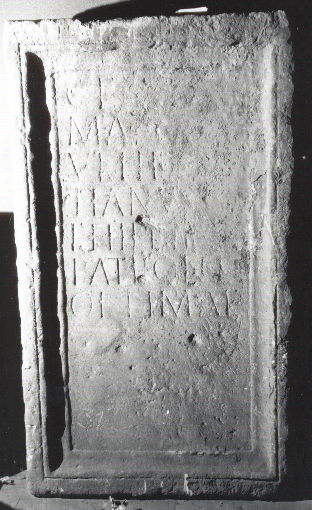

# EDH HD038892. Apulum

**Країна.** Румунія

**Провінція (код EDH).** Dac

**Місце знахідки (антична назва).** Apulum

**Сучасна назва.** Alba Iulia

**Деталі знахідки.** {Vorstadt}, Friedhof der orthodoxen Kirche

**Координати.** 46.074823405,23.585393428

**Зберігання.** Alba Iulia, Muz. Unirii

**Датування (роки, від'ємні до н. е.).** 107 … 275

**Матеріал.** Kalkstein

**Тип пам'ятки.** Tafel

**Розміри (висота, ширина, глибина, см).** 150.0 × 85.0 × 27.0

## Текст (латинь, скорочення розкрито)

```
Claudiae / Marcian(a)e / Ulpi(i) Domi/tianus et / Philetus / patron(a)e / optimae
```

## Текст у вихідному записі

```
CLAVDIAE / MARCIANE / VLPI DOMI / TIANVS ET / PHILETVS / PATRONE / OPTIMAE
```

## Література

IDR 3, 5, 515; Foto u. Zeichnung.
- CIL 03, 01232. #

## Фото



Джерело https://edh.ub.uni-heidelberg.de/edh/inschrift/HD038892, ліцензія CC BY-SA 4.0. Оригінальний XML в архіві сирі_дані/edh_xml.zip
