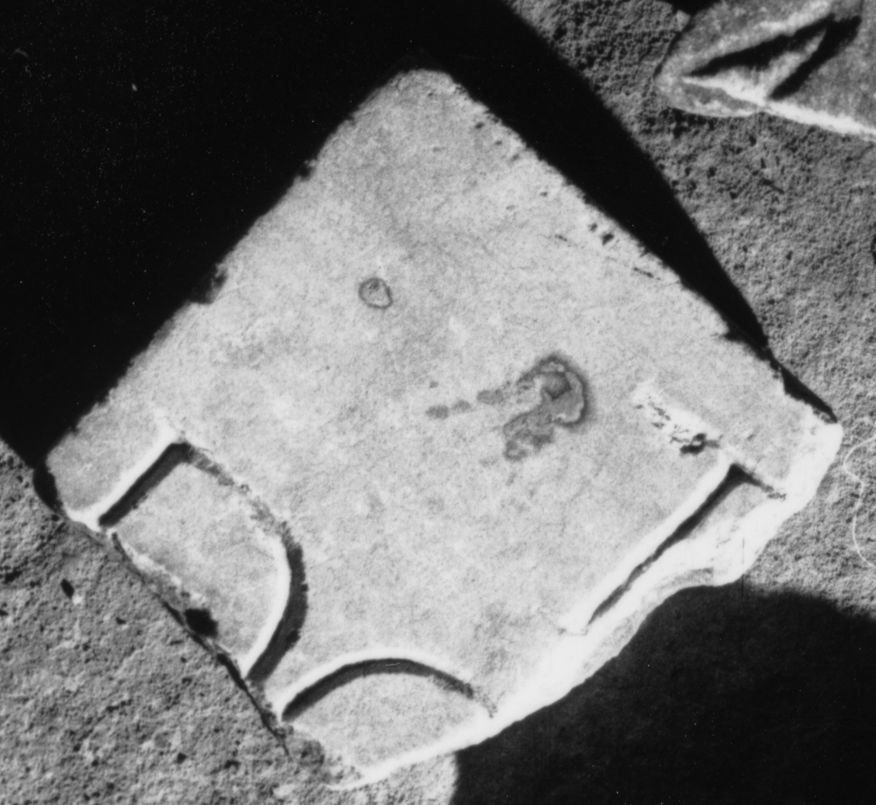

# EDH HD038933. Apulum

**Країна.** Румунія

**Провінція (код EDH).** Dac

**Місце знахідки (антична назва).** Apulum

**Сучасна назва.** Alba Iulia

**Деталі знахідки.** {Dealul Furcilor}

**Координати.** 46.058141585,23.569107006

**Рік знахідки.** 1908

**Зберігання.** Alba Iulia, Muz. Unirii

**Датування (роки, від'ємні до н. е.).** 197 … 300

**Матеріал.** Marmor

**Тип пам'ятки.** Tafel

**Розміри (висота, ширина, глибина, см).** -52.0 × -46.0 × 2.5

## Текст (латинь, скорочення розкрито)

```
D(is) M(anibus) / Domit(io) Nic[---] / [mun(icipii)] S(eptimii) Apul(ensis) v[ix(it) a(nnos) ---] / [Dom(itius) E]ufras Au[g(ustalis)] / [--- p]atron[o] / [pienti]ssim(o) pos(uit)
```

## Текст у вихідному записі

```
D M / DOMIT NIC[ ] / [ ] S APVL V[ ] / [ ]VFRAS AV[ ] / [ ]ATRON[ ] / [ ]SSIM POS
```

## Коментар

10 aneinanderpassende Fragmente. An der gleichen Stelle gefunden wie IDR III 5, 534 und IDR III 5, 618. Datierung: nicht vor 197 n. Chr., als Apulum municipium wurde.

## Література

AE 1996, 1277.
- I. Piso, SpNov 11, 1995, 162-164; Abb. 2a; Abb. 2b (Zeichnung). - AE 1996.
- C. Ciongradi, Grabmonument und sozialer Status in Oberdakien (Cluj-Napoca 2007) 274-275, Nr. T/A 10; Taf. 127 (Zeichnung).
- IDR 3, 5, 525; Foto u. Zeichnung. #

## Фото



Джерело https://edh.ub.uni-heidelberg.de/edh/inschrift/HD038933, ліцензія CC BY-SA 4.0. Оригінальний XML в архіві сирі_дані/edh_xml.zip
