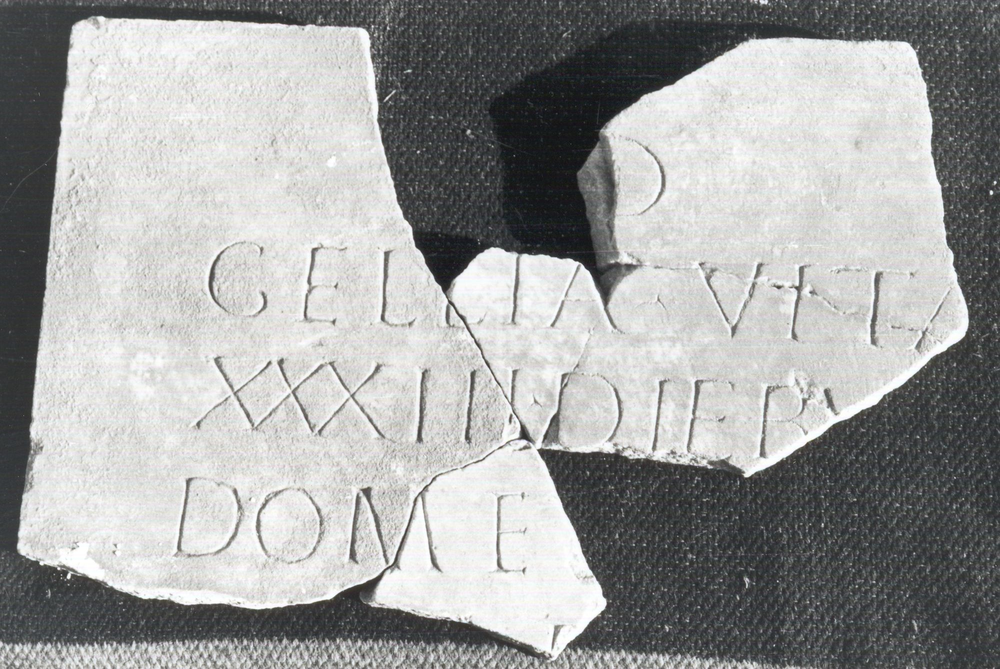

# EDH HD038940. Apulum

**Країна.** Румунія

**Провінція (код EDH).** Dac

**Місце знахідки (антична назва).** Apulum

**Сучасна назва.** Alba Iulia

**Деталі знахідки.** {Dealul Furcilor}

**Координати.** 46.058141585,23.569107006

**Рік знахідки.** 1908

**Зберігання.** Alba Iulia, Muz. Unirii

**Датування (роки, від'ємні до н. е.).** 197 … 275

**Матеріал.** Marmor

**Тип пам'ятки.** Tafel

**Розміри (висота, ширина, глибина, см).** -50.0 × -33.0 × 2.0

## Текст (латинь, скорочення розкрито)

```
D(is) [M(anibus)] / Gellia Vita(?) [vixit annis] / XXXIII diebu[s ---] / Dom(itius) Eu[fras Aug(ustalis)? mun(icipii)? S(eptimii)? Apul(ensis)?] / [---]I(?)D(?)[---] / [&
```

## Текст у вихідному записі

```
D [ ] / GELLIA VITA [ ] / XXXIII DIEBV[ ] / DOM EV[ ] / [ ]ID[ ] / [
```

## Коментар

Fünf aneinanderpassende Fragmente erhalten. Z. 2: möglicherweise auch Vita[lis. Domitius Eufras ist auch bekannt aus der Inschrift IDR III 5, 525. Datierung: Falls Die Ergänzung in Z. 4 stimmt, nicht vor 197 n. Chr. An der gleichen Stelle gefunden wie IDR III 5, 525 und IDR III 5, 618.

## Література

AE 1996, 1278.
- I. Piso, SpNov 11, 1995, 163-164; Abb. 3a; Abb. 3b (Zeichnung). - AE 1996.
- IDR 3, 5, 534; Foto u. Zeichnung.
- C. Ciongradi, Grabmonument und sozialer Status in Oberdakien (Cluj-Napoca 2007) 276, Nr. T/A 15; Taf. 127 (Zeichnung). #

## Фото



Джерело https://edh.ub.uni-heidelberg.de/edh/inschrift/HD038940, ліцензія CC BY-SA 4.0. Оригінальний XML в архіві сирі_дані/edh_xml.zip
