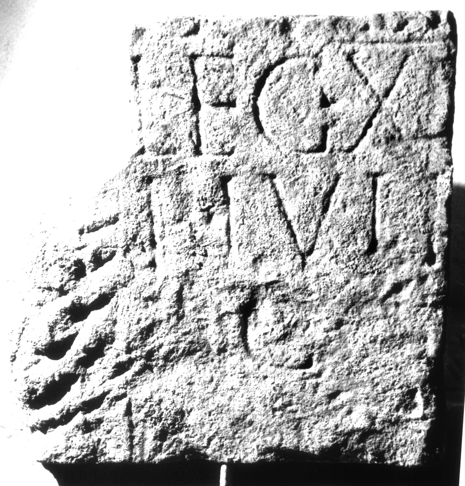

# EDH HD038946. Apulum

**Країна.** Румунія

**Провінція (код EDH).** Dac

**Місце знахідки (антична назва).** Apulum

**Сучасна назва.** Alba Iulia

**Деталі знахідки.** Praetorium des Statthalters

**Координати.** 46.076691,23.580099

**Зберігання.** Alba Iulia, Muz. Unirii

**Датування (роки, від'ємні до н. е.).** 151 … 270

**Матеріал.** Kalkstein

**Тип пам'ятки.** Stele?

**Розміри (висота, ширина, глибина, см).** -38.0 × -38.0 × 18.0

## Текст (латинь, скорочення розкрито)

```
$] / G[---] / leg(ionis) XI[II gem(inae) ---?] / P(ublius) Iuli[us ---] / G[---] / [&
```

## Текст у вихідному записі

```
] / G[ ] / LEG XI[ ] / P IVLI[ ] / G[ ] / [
```

## Коментар

Rechter Teil einer Stele oder Tafel. In späterer Zeit bearbeitet und als Baustein wiederverwendet.

## Література

IDR 3, 5, 540; Foto u. Zeichnung. #

## Фото



Джерело https://edh.ub.uni-heidelberg.de/edh/inschrift/HD038946, ліцензія CC BY-SA 4.0. Оригінальний XML в архіві сирі_дані/edh_xml.zip
