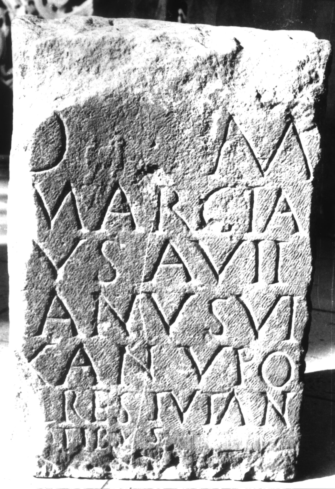

# EDH HD038953. Apulum

**Країна.** Румунія

**Провінція (код EDH).** Dac

**Місце знахідки (антична назва).** Apulum

**Сучасна назва.** Alba Iulia

**Координати.** 46.0669444,23.569999999

**Зберігання.** Alba Iulia, Muz. Unirii

**Датування (роки, від'ємні до н. е.).** 151 … 275

**Матеріал.** Kalkstein

**Тип пам'ятки.** Stele?

**Розміри (висота, ширина, глибина, см).** -56.0 × -37.0 × 18.0

## Текст (латинь, скорочення розкрито)

```
D(is) M(anibus) / Marcia[n]us Avitianus vi/x(erunt?) an(nos) V po(suit) / [-]l(---) Restuta n/[ep]otibus
```

## Текст у вихідному записі

```
D M / MARCIA[ ]VS AVITIANVS VI / X AN V PO / [ ]L RESTVTA N / [ ]OTIBVS
```

## Коментар

Fragment einer Stele oder Tafel.

## Література

IDR 3, 5, 553; Foto u. Zeichnung. #

## Фото



Джерело https://edh.ub.uni-heidelberg.de/edh/inschrift/HD038953, ліцензія CC BY-SA 4.0. Оригінальний XML в архіві сирі_дані/edh_xml.zip
