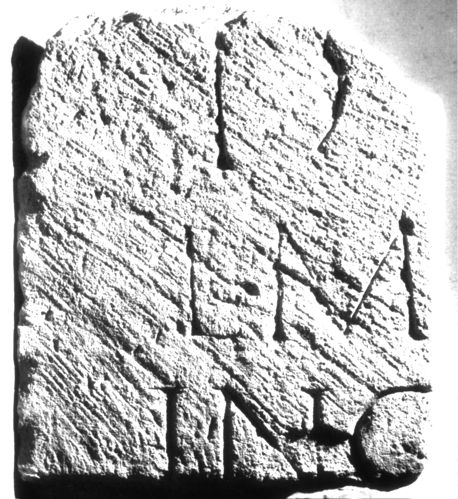

# EDH HD038954. Apulum

**Країна.** Румунія

**Провінція (код EDH).** Dac

**Місце знахідки (антична назва).** Apulum

**Сучасна назва.** Alba Iulia

**Деталі знахідки.** Dealul Furcilor, römische Nekropole

**Координати.** 46.0669444,23.569999999

**Зберігання.** Alba Iulia, Muz. Unirii

**Датування (роки, від'ємні до н. е.).** 151 … 270

**Матеріал.** Kalkstein

**Тип пам'ятки.** Stele

**Розміри (висота, ширина, глибина, см).** -38.0 × -33.0 × 17.0

## Текст (латинь, скорочення розкрито)

```
D(is) [M(anibus)] / L(ucius) M[arius?] / Ing[enuus?] / [&
```

## Текст у вихідному записі

```
D [ ] / L M[ ] / ING[ ] / [
```

## Коментар

Linker Teil einer Stele oder Tafel; als Baustein wiederverwendet.

## Література

IDR 3, 5, 554; Foto. #

## Фото



Джерело https://edh.ub.uni-heidelberg.de/edh/inschrift/HD038954, ліцензія CC BY-SA 4.0. Оригінальний XML в архіві сирі_дані/edh_xml.zip
