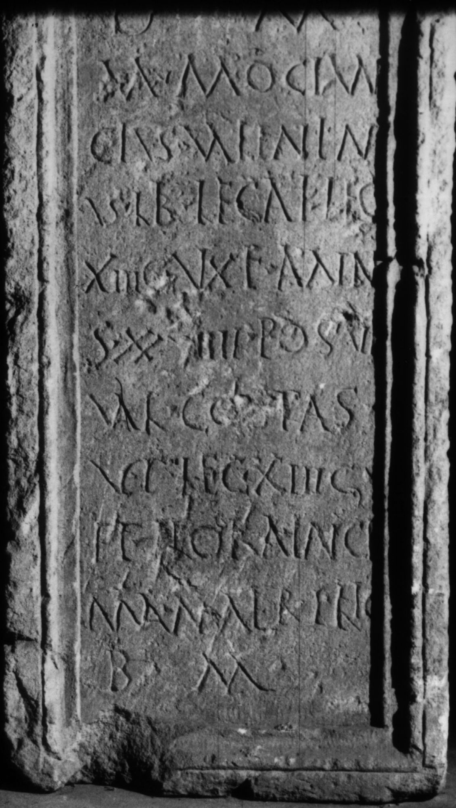
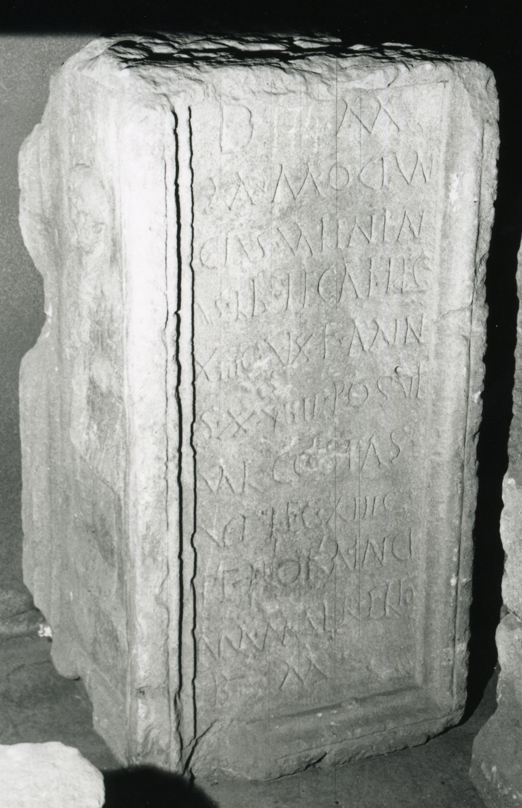
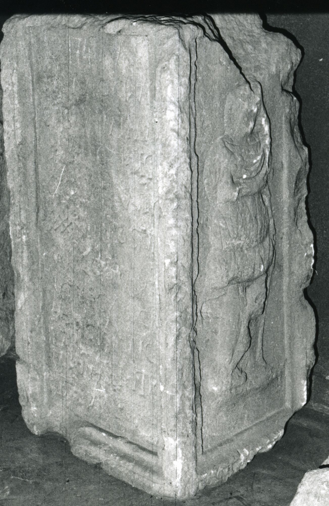

# EDH HD038956. Apulum

**Країна.** Румунія

**Провінція (код EDH).** Dac

**Місце знахідки (антична назва).** Apulum

**Сучасна назва.** Alba Iulia

**Деталі знахідки.** Garten von Sárdy

**Координати.** 46.0669444,23.569999999

**Зберігання.** Alba Iulia, Muz. Unirii

**Датування (роки, від'ємні до н. е.).** 168 … 275

**Матеріал.** Gesteine

**Тип пам'ятки.** Basis

**Розміри (висота, ширина, глибина, см).** 112.0 × 59.0 × 51.0

## Текст (латинь, скорочення розкрито)

```
D(is) M(anibus) / M(arcus) Mociun/cius Valentin/us lib(rarius) legati leg(ionis) / XIII g(eminae) v(i)xit ann(i)s XXVIIII posuit / Val(erius) Co(n)sta(n)s / vet(eranus) leg(ionis) XIII g(eminae) / et Floria Inge/nua mater filio / b(ene) m(erenti)
```

## Текст у вихідному записі

```
D M / M MOCIVN / CIVS VALENTIN / VS LIB LEGATI LEG / XIII G VXIT ANNS XXVIIII POSVIT / VAL COSTAS / VET LEG XIII G / ET FLORIA INGE / NVA MATER FILIO / B M
```

## Література

IDR 3, 5, 556; Foto u. Zeichnung.
- CIL 03, 01194. #

## Фото







Джерело https://edh.ub.uni-heidelberg.de/edh/inschrift/HD038956, ліцензія CC BY-SA 4.0. Оригінальний XML в архіві сирі_дані/edh_xml.zip
