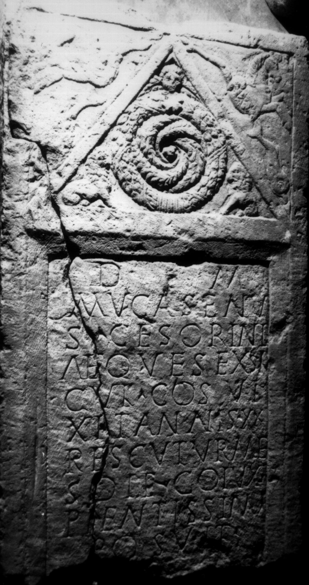
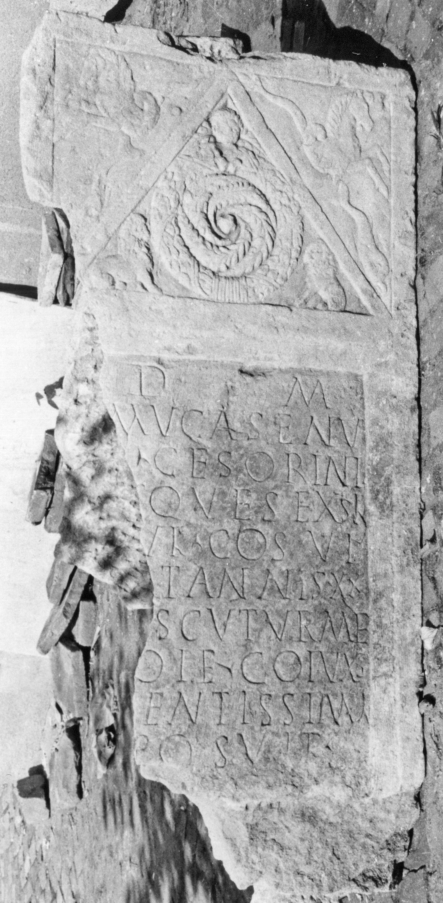
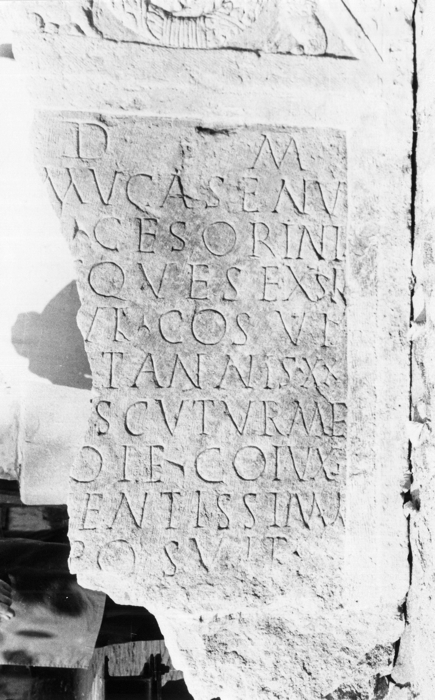
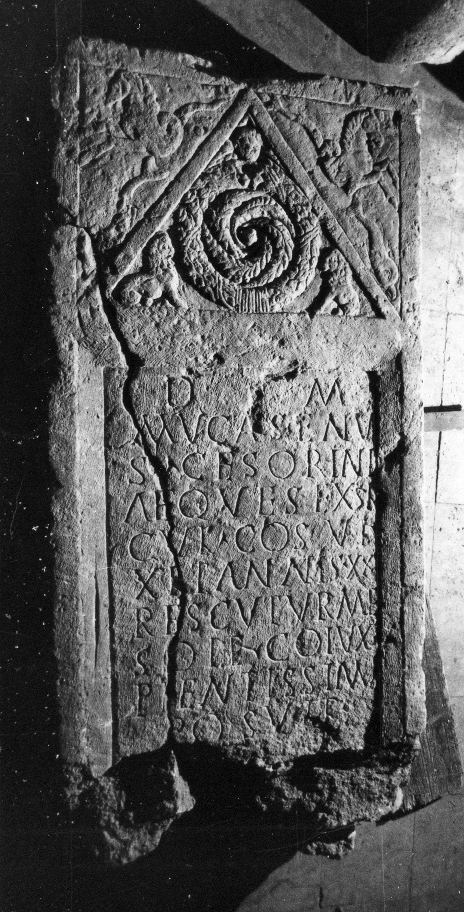

# EDH HD038957. Apulum

**Країна.** Румунія

**Провінція (код EDH).** Dac

**Місце знахідки (антична назва).** Apulum

**Сучасна назва.** Alba Iulia

**Деталі знахідки.** {Vorstadt}, sekundär verwendet

**Координати.** 46.071678487,23.584762877

**Рік знахідки.** 1820

**Зберігання.** Alba Iulia, Muz. Unirii

**Датування (роки, від'ємні до н. е.).** 168 … 212

**Матеріал.** Kalkstein

**Тип пам'ятки.** Stele

**Розміри (висота, ширина, глибина, см).** 180.0 × 95.0 × 24.0

## Текст (латинь, скорочення розкрито)

```
D(is) M(anibus) / Mucasenu/s Ce(n)sorini / aeques(!) ex sin/gul(ari) co(n)s(ularis) vi/xit annis XX / Rescuturme / Soi(a)e co(n)iux / pientissima / posuit // [b(ene) m(erenti)]
```

## Текст у вихідному записі

```
D M / MVCASENV / S CESORINI / AEQVES EX SIN / GVL COS VI / XIT ANNIS XX / RESCVTVRME / SOIE COIVX / PIENTISSIMA / POSVIT / / [ ]
```

## Коментар

Stele in zwei Teile gebrochen. Oberhalb des Inschriftfeldes Giebel: im Giebelfeld mittig eine Spiralrosette, darüber ein Gorgoneion und in den beiden Zwickeln Löwen. In den Zwickeln über dem Giebel je ein Hippokamp. Z. 11: auf dem unteren Rahmen; bei der Auffindung noch vorhanden. Datierung: term. post. quem: 168 n. Chr., da der Statthalter als consularis bezeichnet wird; term. ante quem: aufgrund der Namen vor der Constitutio Antoniniana 212 n. Chr.

## Література

IDR 3, 5, 558; Foto u. Zeichnung.
- CIL 03, 01195. #

## Фото









Джерело https://edh.ub.uni-heidelberg.de/edh/inschrift/HD038957, ліцензія CC BY-SA 4.0. Оригінальний XML в архіві сирі_дані/edh_xml.zip
