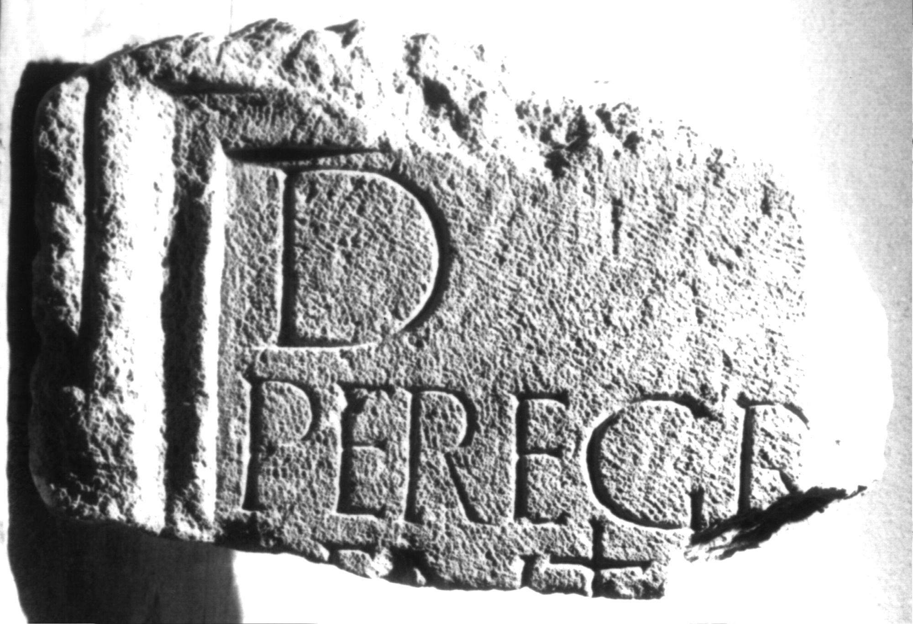

# EDH HD038959. Apulum

**Країна.** Румунія

**Провінція (код EDH).** Dac

**Місце знахідки (антична назва).** Apulum

**Сучасна назва.** Alba Iulia

**Деталі знахідки.** Festung, {Báthory-Kirche}, sekundär verwendet

**Координати.** 46.068786971,23.571510313

**Зберігання.** Alba Iulia, Muz. Unirii

**Датування (роки, від'ємні до н. е.).** 106 … 200

**Матеріал.** Kalkstein

**Тип пам'ятки.** Tafel

**Розміри (висота, ширина, глибина, см).** -23.0 × -34.0 × 17.0

## Текст (латинь, скорочення розкрито)

```
D(is) [M(anibus)] / Peregr[inus? ---]/entis [---] / [&
```

## Текст у вихідному записі

```
D [ ] / PEREGR[ ] / ENTIS [ ] / [
```

## Коментар

Oberer linker Teil einer Tafel. IDR 3, 5: Z. 2: Peregr[inus, -a ---].

## Література

IDR 3, 5, 562; Foto u. Zeichnung. #

## Фото



Джерело https://edh.ub.uni-heidelberg.de/edh/inschrift/HD038959, ліцензія CC BY-SA 4.0. Оригінальний XML в архіві сирі_дані/edh_xml.zip
