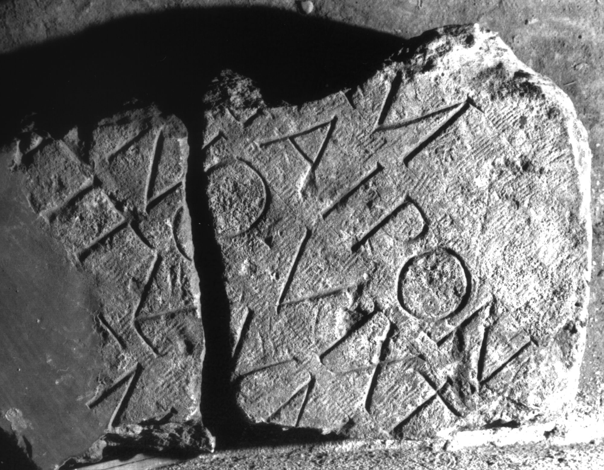

# EDH HD038960. Apulum

**Країна.** Румунія

**Провінція (код EDH).** Dac

**Місце знахідки (антична назва).** Apulum

**Сучасна назва.** Alba Iulia

**Деталі знахідки.** Praetorium des Statthalters?

**Координати.** 46.076691,23.580099

**Зберігання.** Alba Iulia, Muz. Unirii

**Датування (роки, від'ємні до н. е.).** 171 … 270

**Матеріал.** Kalkstein

**Тип пам'ятки.** Tafel

**Розміри (висота, ширина, глибина, см).** -47.0 × -40.0 × 15.0

## Текст (латинь, скорочення розкрито)

```
[D(is)] M(anibus) / [---] Gai Pon[tii? ---] / [---]ano vixit [an(nos) ---] / [---] titulum [---] / [---]EM[---] / [&?
```

## Текст у вихідному записі

```
[ ] M / [ ] GAI PON[ ] / [ ]ANO VIXIT [ ] / [ ] TITVLVM [ ] / [ ]EM[ ] / [
```

## Коментар

Zwei aneinanderpassende Fragmente einer Tafel.

## Література

IDR 3, 5, 564; Foto u. Zeichnung. #

## Фото



Джерело https://edh.ub.uni-heidelberg.de/edh/inschrift/HD038960, ліцензія CC BY-SA 4.0. Оригінальний XML в архіві сирі_дані/edh_xml.zip
