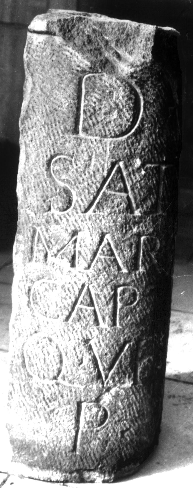
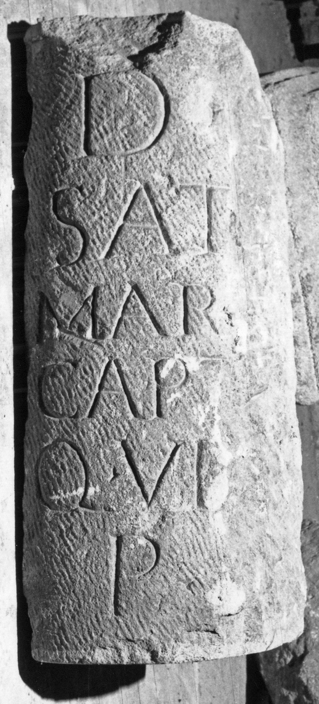

# EDH HD038964. Apulum

**Країна.** Румунія

**Провінція (код EDH).** Dac

**Місце знахідки (антична назва).** Apulum

**Сучасна назва.** Alba Iulia

**Координати.** 46.0669444,23.569999999

**Зберігання.** Alba Iulia, Muz. Unirii

**Датування (роки, від'ємні до н. е.).** 151 … 270

**Матеріал.** Kalkstein

**Тип пам'ятки.** Architekturteil

**Розміри (висота, ширина, глибина, см).** -65.0 × 30.0

## Текст (латинь, скорочення розкрито)

```
D(is) [M(anibus)] / Sat[---] / Mar[---] / capt[---] / q(ui) vix(it) [a(nnos) --] / P [---]
```

## Текст у вихідному записі

```
D [ ] / SAT[ ] / MAR[ ] / CAPT[ ] / Q VIX [ ] / P [ ]
```

## Коментар

Teil eines Säulenschaftes.

## Література

IDR 3, 5, 570; Foto u. Zeichnung. #

## Фото





Джерело https://edh.ub.uni-heidelberg.de/edh/inschrift/HD038964, ліцензія CC BY-SA 4.0. Оригінальний XML в архіві сирі_дані/edh_xml.zip
